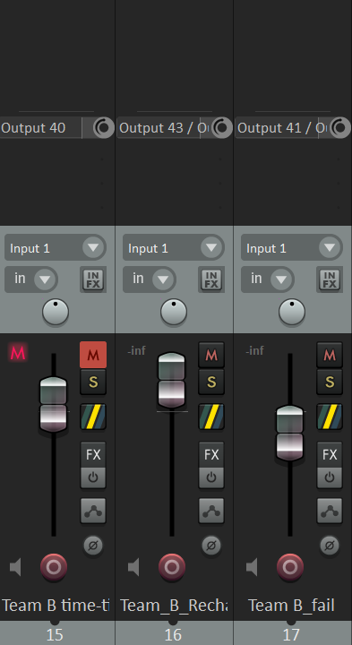
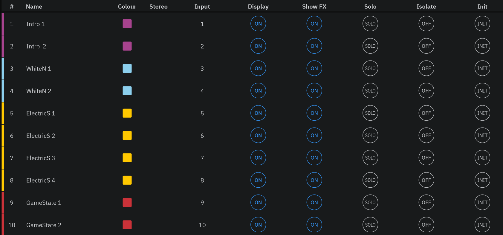
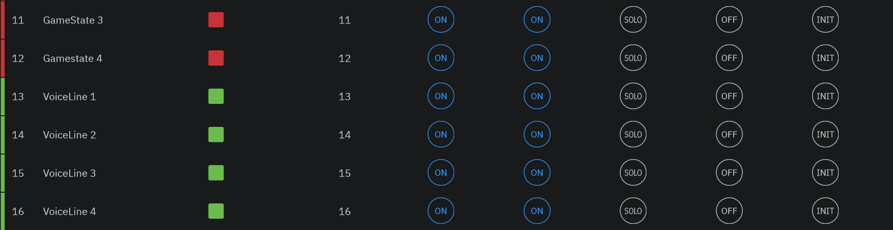
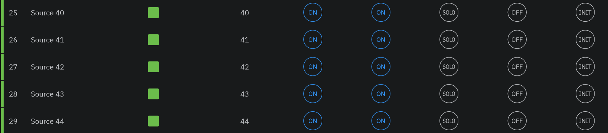
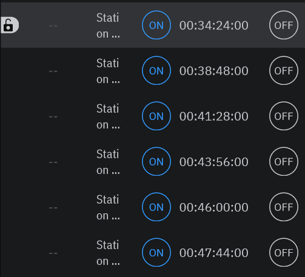
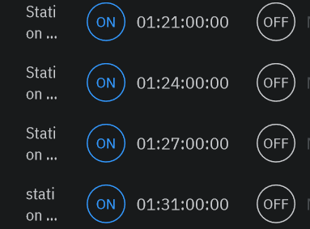
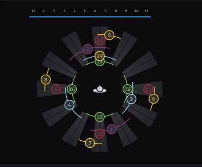
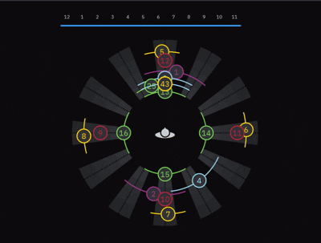
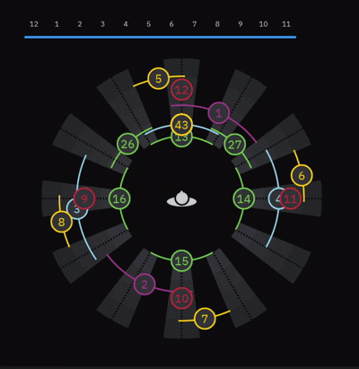

# Final Game Tracks

---

## Audio Assets Breakdown

#### Ambient Sound
*Plays continuously throughout gameplay:*
* [`Electric_spark.mp3`](Audio%20Tracks/Common%20BGM/Electric_spark.mp3)
* `White_noise.wav`
* [`proj_phantom_bgm.mp3`](Audio%20Tracks/Common%20BGM/proj_phantom_bgm.mp3)

#### Siera Voiceover
*Plays during transitions from tutorials to the hand-gesture game:*
1. [`station 2_gesture-tutorial.wav`](Audio%20Tracks/Siera/station%202_gesture-tutorial.wav)
2. [`station 2_gesture-start.wav`](Audio%20Tracks/Siera/station%202_gesture-start.wav)
3. [`staton 2_shadow-tutorial.wav`](Audio%20Tracks/Siera/staton%202_shadow-tutorial.wav)
4. [`station 2_shadow-start.wav`](Audio%20Tracks/Siera/station%202_shadow-start.wav)
5. [`Siera-Station-2-Complete.mp3`](Audio%20Tracks/Siera/Siera-Station-2-Complete.mp3) *(Station completion trigger)*

#### Gameplay Sound Effects
* [`loading_effect.mp3`](Audio%20Tracks/loading_effect.mp3) *(Used for progress bar)*
* [`recharge.mp3`](Audio%20Tracks/recharge.mp3)
* [`clock-ticking.mp3`](Audio%20Tracks/clock-ticking.mp3)

#### Game State Audio
* [`game_end.mp3`](Audio%20Tracks/Common%20BGM/game_end.mp3)

---

## REAPER Track Organization & Signal Routing

### 1. Ambient & System Tracks
> **Setup Reference:**  
> 

| Track Name | Source File | Hardware / Bus Output Routing |
| :--- | :--- | :--- |
| **Track 2** | `proj_phantom_bgm.mp3` | `Output 1 / Output 2` |
| **Track 3** | `White_noise.wav` | `Output 3 / Output 4` |
| **Track 4** | `Electric_spark.mp3` | `Output 5 / Output 6` & `Output 7 / Output 8` |
| **Track 5** | `game_end.mp3` | `Output 9 / Output 10` & `Output 11 / Output 12` |
| **Track 6** | *Siera Voiceover Sequence* | `Output 13 / Output 14` & `Output 15 / Output 16` |

### 2. Gameplay Tracks
> **Setup Reference:**  
> 

| Track Name | Source File(s) | Hardware / Bus Output Routing |
| :--- | :--- | :--- |
| **Track 15** | `clock-ticking.mp3` | `Output 40` |
| **Track 16** | `loading_effect.mp3`, `recharge.mp3` | `Output 43 / Output 44` |
| **Track 17** | `fail.mp3` | `Output 41 / Output 42` |

---

### Markers (Reaper)
| Marker ID | Marker Name | Command ID | Event Description |
| :--- | :--- | :--- | :--- |
| Marker 11 | Team B - Start time ticking | 41251 | [`Clock-Ticking.mp3`](Audio%20Tracks/clock-ticking.mp3) plays during hand and shadow sequence gameplay |
| Marker 12 | Team B - Failing | 41252 | failed stage during hand and shadow sequence gameplay, [`fail.mp3`](Audio%20Tracks/fail.mp3) plays |
| Marker 13 | Team B - Loading | 41253 | when the progress bar starts to load, [`loading_effect.mp3`](Audio%20Tracks/loading_effect.mp3) plays |
| Marker 14 | Team B - Recharge | 41254 | [`recharge.mp3`](Audio%20Tracks/recharge.mp3) plays when each stage are cleared during gameplay |
| Marker 15 | Team B - Good job | 41255 | when each tutorial stage is cleared, first 3s of [`station 2_gesture-tutorial.wav`](Audio%20Tracks/Siera/station%202_gesture-tutorial.wav) is played |
| Marker 10 | Team B - Transition Team E | 40160 | players completed the game, Siera track -- [`Siera-Station-2-Complete.mp3`](Audio%20Tracks/Siera/Siera-Station-2-Complete.mp3) starts playing |
| Marker 1 | Hand gesture Tutorial | 40161 | when game is initialising, [`station 2_gesture-tutorial.wav`](Audio%20Tracks/Siera/station%202_gesture-tutorial.wav) is played |
| Marker 7 | Hand gesture sequence | 40167 | transiting from hand gesture tutorial to hand gesture sequence, [`station 2_gesture-start.wav`](Audio%20Tracks/Siera/station%202_gesture-start.wav) plays |
| Marker 28 | shadow tutorial | 41268 | transiting from hand gesture sequence to shadow tutorial, [`station 2_shadow-tutorial.wav`](Audio%20Tracks/Siera/station%202_shadow-tutorial.wav) plays |
| Marker 30 | shadow seq | 41270 | transiting from hand gesture sequence to shadow tutorial, [`station 2_shadow-start.wav`](Audio%20Tracks/Siera/station%202_shadow-start.wav) plays |

---

## L-ISA Configuration

### Source & Timecode Setup

  

  

  

    <i><u>Midi Timecode:</u></i>

  <i> MIDI set up during gameplay/tutorial: </i>
    
  

  <i> MIDI set up for transitions: </i>
  

### Timecode Snapshots (L-ISA)
| Timecode | Marker ID | Team / Event Description |
| :--- | :--- | :--- |
| `00:34:24:00` | Marker 11 | Team B - Start time ticking |
| `00:38:48:00` | Marker 12 | Team B - Failing |
| `00:41:28:00` | Marker 13 | Team B - Loading |
| `00:43:56:00` | Marker 14 | Team B - Recharge |
| `00:46:00:00` | Marker 15 | Team B - Good job |
| `00:47:44:00` | Marker 10 | Team B - Transition Team E |
| `01:21:00:00` | Marker 1 | Hand gesture Tutorial |
| `01:24:00:00` | Marker 7 | Hand gesture sequence |
| `01:27:00:00` | Marker 28 | Shadow gesture Tutorial |
| `01:31:00:00` | Marker 30 | Shadow gesture sequence |

### Snapshots & Spatialization

<u><i>Ambient/Siera's Voice Transition:</i></u>

  

<u><i>Clock-Ticking:</i></u>

  

<u><i>Fail:</i></u>

  

<u><i>Loading:</i></u>

  

<u><i>Recharge/Good Job:</i></u>

  

---

*For detailed software configuration guides, refer to the **[L-ISA Setup Documentation](../../MVP/L-ISA/README.md)**.*

*For Reaper Setup Documentation, read [**Reaper Setup and Configuration**](../../MVP/reaper/README.md) only.*