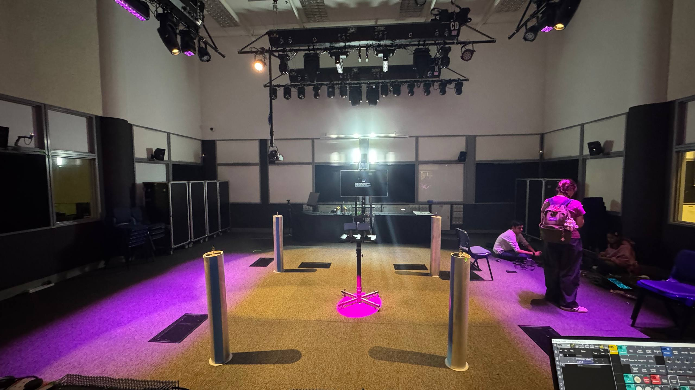
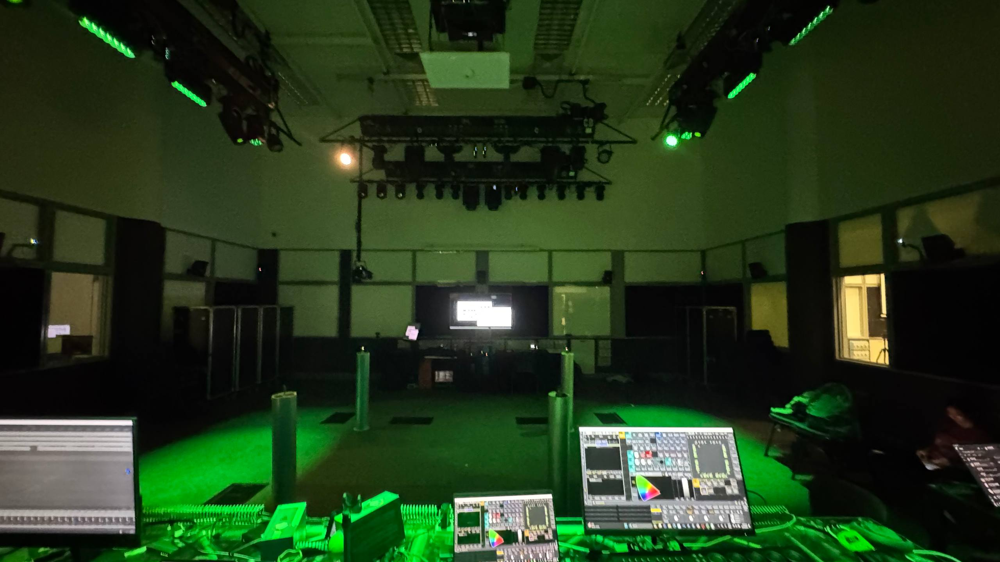
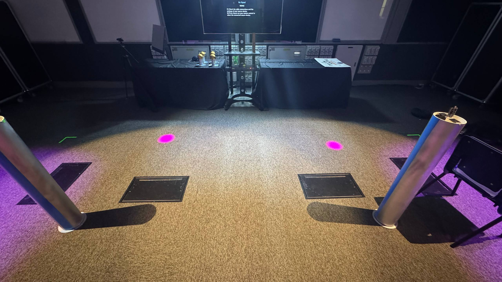
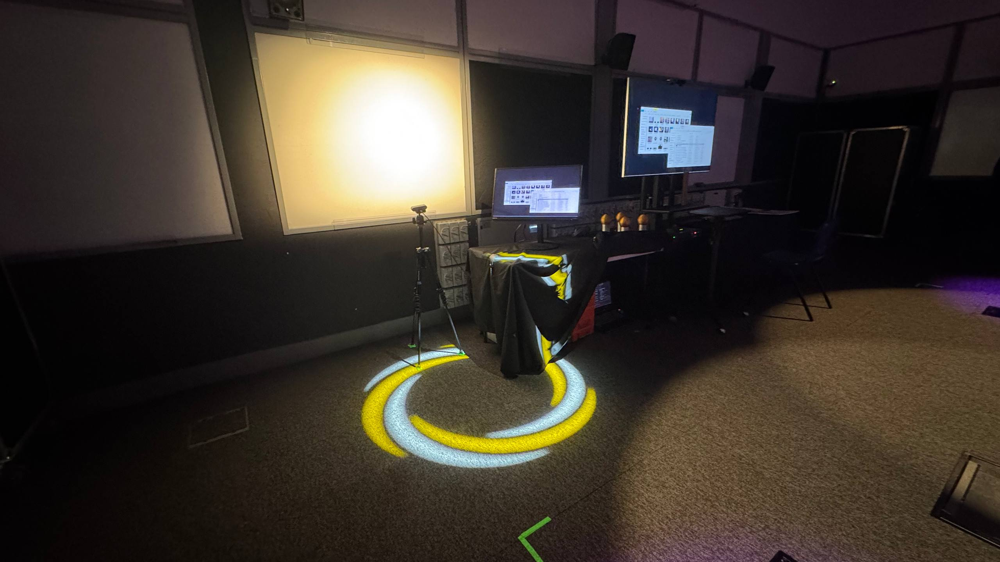
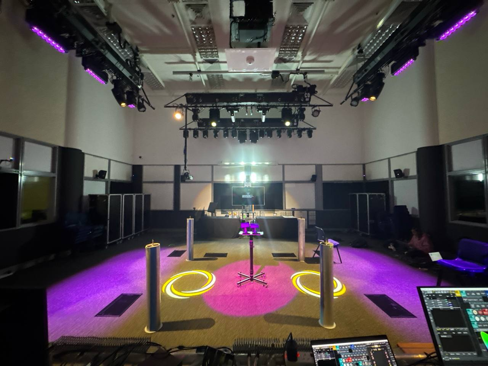
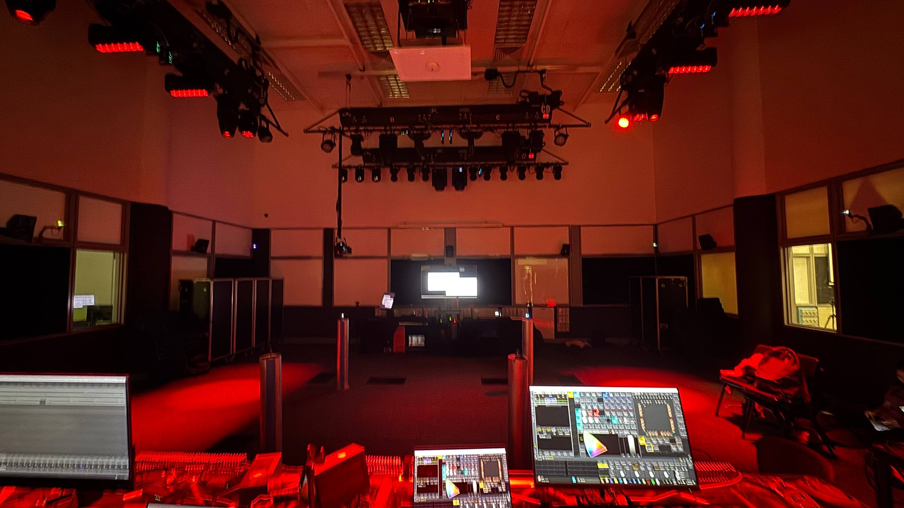

# grandMA3 Game Flow Documentation

This document follows the actual game flow from Station A through Team B gameplay, documenting all grandMA3 macros and sequences with space for screenshots.

The following sequences can be found in `Project Phantom.show` 

---
## Flow Overview
```
Station A (end State)
        ↓
Team B Start → Macro 10
        ↓
Tutorial Stage 1
        ↓
Tutorial Stage 2
        ↓
Level 1 Play
        ↓
Stage Clear → Sequence 120 Cue 2 + Macro 9 (Charging)
        ↓
Level 2 Play
        ↓
Stage Clear → Sequence 120 Cue 2 + Macro 9 (Charging)
        ↓
Level 3 (Shadow Tutorial)
        ↓
Level 3 Play → Sequence 120 Cue 2 + Macro 9 (Charging)
        ↓
Game Clear → Macro 13
```

**Failure Path (any level):**
```
Player Fails → Sequence 120 Cue 1
        ↓
Retry / Continue
```

**Game Over (all lives lost):**
```
Game Over → Macro 12
```

---

## Station A — Initial State

**Description:** System idle state before game begins. Controlled from Station A.

**grandMA3 State:**

- active sequences ( zone a-d & charging zone cue 2)
- System ready for Team B start trigger

**Screenshot:**


---

## Team B Start — Game Initialization

**Trigger:** Game start command from Station A or system initialization

**grandMA3 Command:** `go macro 10;`

**Macro 10 — System Start**

**Purpose:** Initializes lighting, cues, and system state for Team B gameplay

**Screenshot:**


---

## Tutorial Stage 1

**Description:** First tutorial stage — players learn basic gesture matching (same gestures)

**grandMA3 State:**

- Tutorial lighting state active
- No macro/sequence triggers during tutorial itself

**Screenshot:**



---


## Level 1-2 Play

**Description:** First playable level — 4 targets, player zones active

**grandMA3 State:**

- Level 1-2 lighting active
- Timer and game state cues running


---

## Stage Clear — Success Path

**Trigger:** All targets matched successfully, hold duration completed

**grandMA3 Commands:**

```
go sequence 120 cue 2;
go macro 9;
```

### Sequence 120 Cue 2 — Stage Clear

**Purpose:** Triggers stage completion lighting, sound, or visual feedback

**Screenshot:**



---

### Macro 9 — Charging Macro

**Purpose:** Activates "charging" lighting effect for phantom blaster

**Action:** The two pink lights dart toward the charging zone in the centre expanding it as the game progresses 

**Screenshot:**



---
## Level 3 — Shadow Tutorial Play

**Description:** Shadow-based gesture recognition using AI model (animal shadows)

**grandMA3 State:**

- Shadow tutorial lighting active
- Player position marker appears to direct player over from first position

**Screenshot:**



---

## Level 3 — Main Play

**Description:** Final level — full shadow gesture recognition gameplay

**grandMA3 State:**

- Level 3 main gameplay lighting
- Player position marker appears to direct player over from first position


---

## Game Clear — Victory

**Trigger:** All Level 3 stages completed successfully

**grandMA3 Command:** `go macro 13;`

### Macro 13 — Game Clear / Victory

**Purpose:** Triggers victory lighting, sound, and end-game state

**Screenshot:**



---

## Failure Path — Player Loses Life

**Trigger:** Timer runs out before all targets matched

**grandMA3 Command:** `on sequence 120 cue 1;`

### Sequence 120 Cue 1 — Life Lost

**Purpose:** Triggers failure lighting, sound, or visual feedback

**Screenshot:**



---

## Game Over — All Lives Lost

**Trigger:** Player loses all 3 lives

**grandMA3 Command:** `go macro 12;`

### Macro 12 — Game Over

**Purpose:** Triggers game over state, resets system tutorial 1.
**Screenshot:**


---


## Command Reference Table

| Game State | Trigger | grandMA3 Command | Object Type | 
|------------|---------|------------------|-------------|
| Team B Start | Game initialization | `go macro 10;` | Macro 10 | 
| Stage Clear | All targets matched | `go sequence 120 cue 2;` | Sequence 120 Cue 2 | 
| Charging | Stage clear success | `go macro 9;` | Macro 9 | 
| Life Lost | Timer expired | `on sequence 120 cue 1;` | Sequence 120 Cue 1 | 
| Level 3 Start | Tutorial complete | `go macro 11;` | Macro 11 |
| Game Clear | All levels complete | `go macro 13;` | Macro 13 |
| Game Over | All lives lost | `go macro 12;` | Macro 12 | 

---

## Notes

- All OSC commands are sent to `/gma3/cmd` on port `8080`
- Macro 9 (Charging) is called alongside Sequence 120 Cue 2 on every successful stage clear
- Sequence 120 Cue 1 is the only failure path trigger
- Ensure all macros and sequences are OSC-enabled in the grandMA3 showfile
- Use semicolon termination (`;`) for all commands for consistency