# Image Classifier on Jupyter Notebook
## Purpose
This is the setup guide for the Jupyter Notebook in order to get the AI to detect the shadows during the shadow level. This section uses Jupyter Notebook to build and train the image classifier step-by-step. Since image models take time to load and need visual checking, the notebook allows us to view sample images directly inline, keep heavy datasets loaded in memory while tweaking settings, and inspect training results after every step.

## Software Setup
We will be adding the notebook as an extension into your Visual Studio Code for easy use! 

1. Open Visual Studio Code or Download [Visual Studio Code](https://code.visualstudio.com/sha/download?build=stable&os=win32-x64-user) (This link automatically downloads VS Code)

2. Once opened, look for extensions on the left of your screen and click on the icon. 

3. On Search Bar on left, search 'Python' and click Install. 

4. Search for Jupyter Notebook and click Install. 

5. Once installed, click the search bar on top middle and type '> Create: New Jupyter Notebook', and press Enter. 

6. A new Notebook would be created. 

7. Select your Python Kernel. Look at top right corner of screen, click 'Select Kernel'. 

8. Once clicked, choose 'Python Environments'. 

9. Select your virtual environment that is Recommended.

10. To see if Jupyter Notebook was installed properly, type `print("Hello, world!")`. Click the play icon. If successful, a tick would be shown!
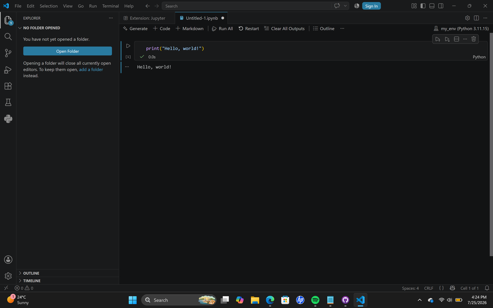

Your Jupyter Notebook is good to go!

## Download of Image Classifier Folder
1. Click on [Essential Folder](./Essential%20Folder) and download all the files found. (Dont forget to come back to this page!)

2. Downloaded, collate the files into one Folder. Name it 'Essential Folder'. 

3. Once done, open your VS Code, click top left, 'File' and select 'Open Folder' 

4. Select the folder Essential Folder that you have created at top. 

5. Click 'Select Kernel'. 

6. Once clicked, choose 'Python Environments'. 

7. Select your virtual environment that is Recommended.

8. **Open Data Preparation File**

    a) Click on `01_data_preparation.ipynb` found in the folder.

    b) Run each code using the Play icon for **each line**.

    

    This would be what you see on screen. 

    
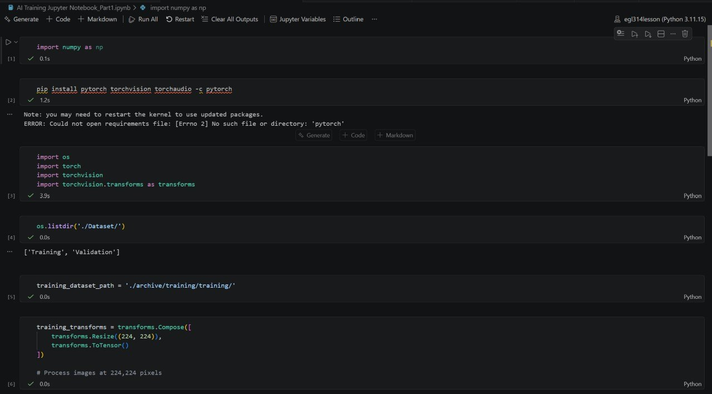

    
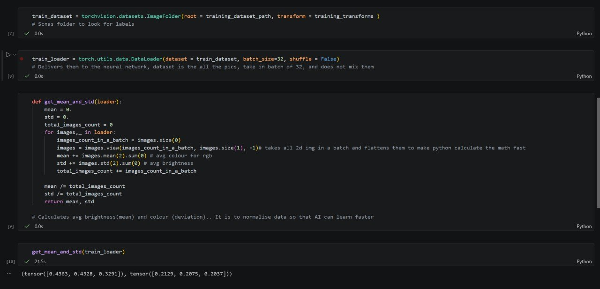

    c) Your code is working if you see the last output being `(tensor([0.4363, 0.4328, 0.3291]), tensor([0.2129, 0.2075, 0.2037]))`

    Your first file is ready!

9. **Open AI Model Training File**

    a) Click on `02_ai_model_training.ipynb` found in the folder. 

    b) Run each code using th Play icon for **each line**. 
    
    

    c) This would be the what you see on screen. 
    
    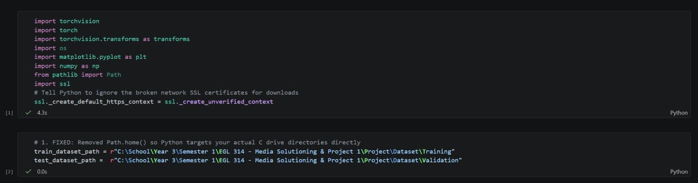

    d) Based on the output from first file being `(tensor([0.4363, 0.4328, 0.3291]), tensor([0.2129, 0.2075, 0.2037]))`, input this into the second code if not shown 
    
    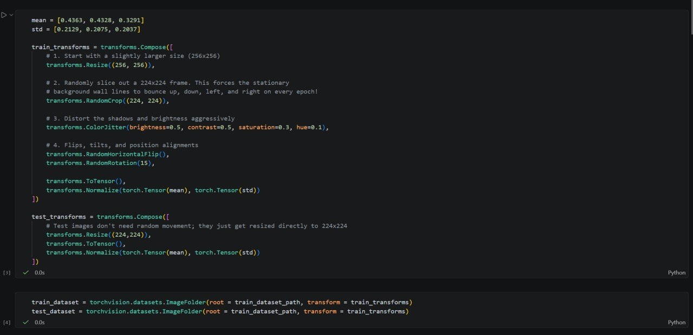

    e) After running the third code, there should be this input to show your code is working and the AI is learning

    
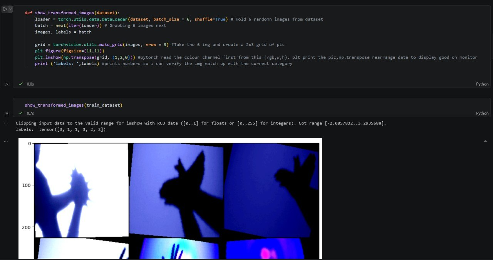

    This should be shown on your screen 

    
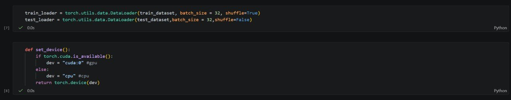

    
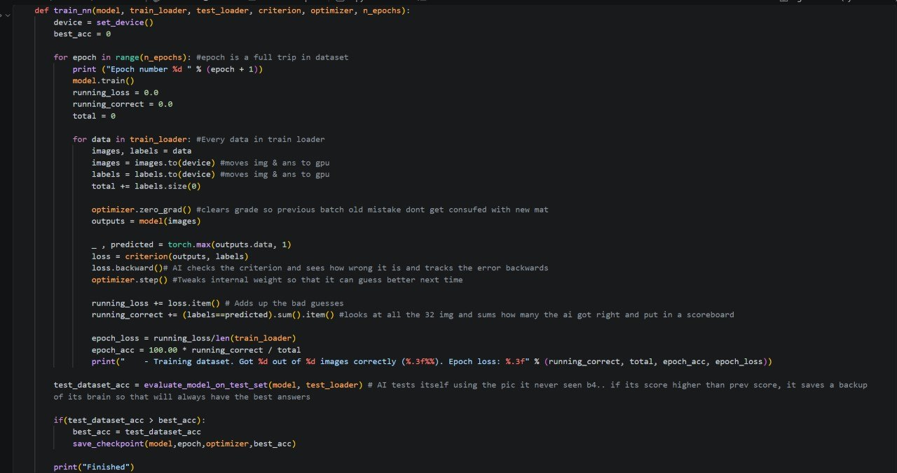

    
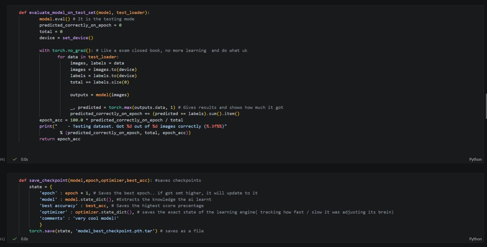

    
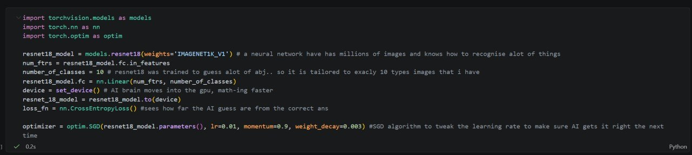

    f) Feeding dataset to model outputs seen
    
    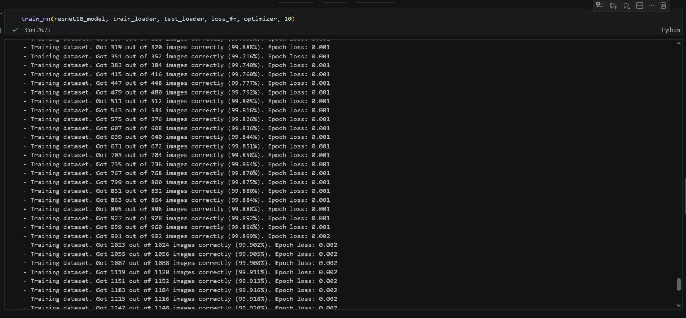
    
    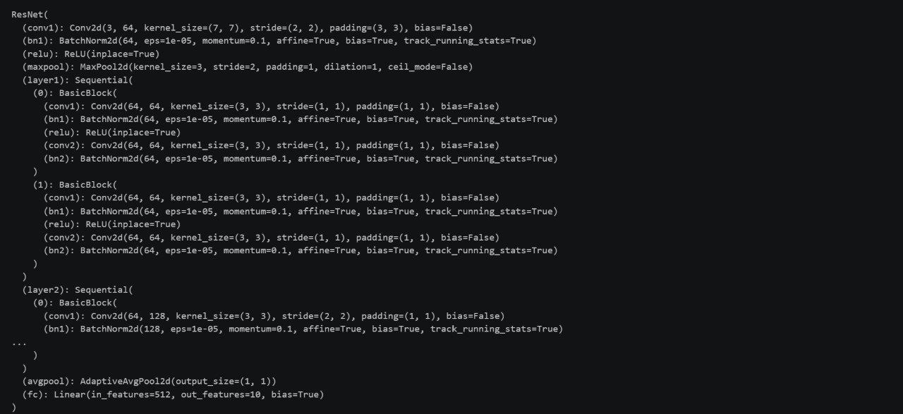

    g) Mini- Batch Training successful would print: `10`
    `very cool model!`
    `99.90366088631984`

    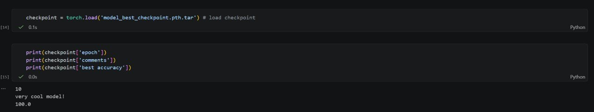

    This should be shown on your screen 
    
    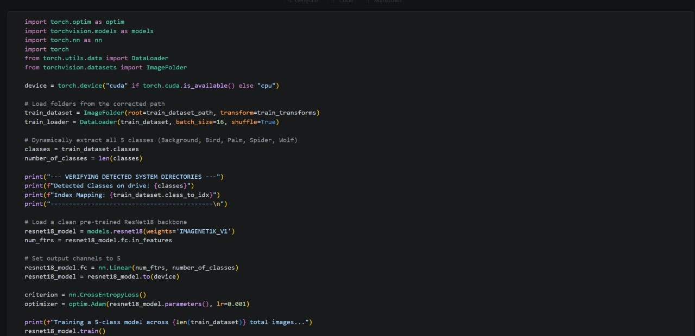

    h) This code line saves and exports the trained ResNet-18 model to a `.pth` for later deployment in game. 

    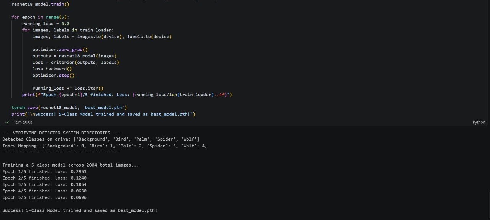

    You are ready to use the `.pth` that will be saved in the same folder as the rest of the files you've run! Have fun! This will be use in the [MVP GameCode.py](<../MVP GameCode.py>)

    Changes made for the files: Dataset has been updated. More Shadows were added, creating a variety to be used for game. 

