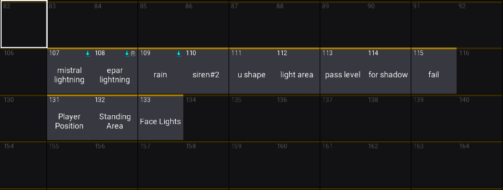
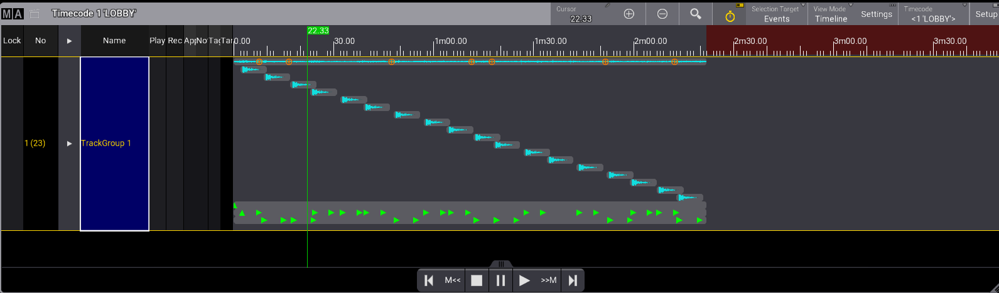

# GrandMA3 Lighting Documentation

## Purpose

This document describes the GrandMA3 lighting sequences created for the Project Phantom MVP. The programming supports environmental effects, game-state feedback, station transitions, player guidance, and presenter visibility.

Sequences are operated either through the programmed timecode workflow or through OSC triggers sent by the Python game application. Individual timecode timestamps are intentionally excluded from this document.

## Sequence Overview

| Sequence | Name | Function | Trigger Method |
|---:|---|---|---|
| 107 | Mistral Lightning | Creates a lightning effect using the Mistral fixtures. | Timecode |
| 108 | E-Par Lightning | Creates a lightning effect using the E-Par fixtures. | Timecode |
| 109 | Rain | Produces a rain-like lighting atmosphere. | Timecode |
| 110 | Siren #2 | Produces an emergency-style atmosphere during gameplay rounds. | OSC from Python |
| 111 | U Shape | Not documented as part of the current MVP lighting operation. | unused |
| 112 | Light Area | Not used in the current documentation scope. | unused |
| 113 | Pass Level | Displays a green confirmation light using an Astera QuickSpot when a player passes a level or round. | OSC from Python |
| 114 | For Shadow | Illuminates the gameplay area used for the Shadow Game station. | OSC from Python |
| 115 | Fail | Changes the Astera fixture to red to indicate a failed game state. | OSC from Python |
| 131 | Player Position | Directs participants from one station to the next during defined station transitions. | OSC from Python from each station |
| 132 | Standing Area | Indicates the designated area where participants should stand at each station, preventing interference with gameplay. | OSC from Python from each station |
| 133 | Face Lights | Improves visibility of station presenters while they introduce their stations. | OSC from Python from each station |

## Timecode Sequences

Sequences 107 to 110 were created as part of the timecode-driven lighting section of the show. Their purpose is to create atmosphere at the start of the experience rather than act as player-feedback indicators.

- **Sequence 107 — Mistral Lightning:** Uses the Mistral fixtures to create a lightning effect.
- **Sequence 108 — E-Par Lightning:** Uses the E-Par fixtures to provide a separate lightning effect.
- **Sequence 109 — Rain:** Establishes a rainy visual atmosphere.

The exact timecode positions are omitted because this documentation focuses on programming intent and sequence function. The timecode arrangement can be adjusted in the show-control workflow without changing the intended role of each sequence.

## Game Feedback via OSC

The Python game application communicates game results to GrandMA3 through OSC. This enables the lighting system to respond immediately to player outcomes.

- **Pass feedback — Sequence 113:** When a player passes a level or round, the Astera QuickSpot outputs green light.
- **Fail feedback — Sequence 115:** When a player fails, the Astera fixture changes to red.

This separation provides clear and immediate visual feedback: green represents a successful result, while red represents a failed result.

## Station Lighting

### Shadow Game Area

**Sequence 114 — For Shadow** lights the area where the team’s Shadow Game is played. This ensures the activity zone is visually defined for both players and observers.

### Player Direction

**Sequence 131 — Player Position** is triggered at specific transition moments between stations. Its purpose is to direct players from their current station to the next required station.

**Sequence 132 — Standing Area** identifies where players should stand at each station. This helps maintain a clear gameplay area and reduces the chance of participants disrupting the game.

### Presenter Visibility

**Sequence 133 — Face Lights** provides appropriate illumination when station speakers introduce their activities. The sequence uses two mini panels configured as a basic interview-style lighting setup:

- One mini panel operates as the **key light**, providing the main illumination on the speaker.
- A second mini panel operates as the **fill light**, reducing harsh shadows and improving facial visibility.
- The specific fixture arrangement differs between stations to suit each station layout.

## Operational Notes

- Sequences 107–110 support the timecode-based environmental lighting section.
- Sequences 113 and 115 provide automated game-state feedback through OSC commands from the Python application.
- Sequences 131–133 support audience flow, player positioning, and station presentation requirements.
- Sequences 111 and 112 are not included in the current MVP operational documentation.
- Before operation, verify that the GrandMA3 OSC input settings, network address, and Python OSC destination settings are correctly configured.