# OSC & L-ISA Integration Guide

## Overview
This software controls 3D surround sound in a room. It connects **REAPER** to **L-ISA** using a virtual MIDI setup (`loopMIDI`), allowing sound positions, movements, and snapshots to play in perfect sync with your audio.

---

## Setup & Configuration

### Step 1: Install Required Software
* Download and install **[L-ISA Studio](https://www.l-acoustics.com/products/l-isa-studio/?pk_vid=86afed12eb3149cc16861759426ba57c)** and **[loopMIDI](https://www.tobias-erichsen.de/software/loopmidi.html)**.
* 📹 **[Watch the L-ISA Installation & Setup Video Guide](https://youtu.be/eVM-51u1GbI?si=CHgpuxDxQGSGWfBy)**

---

### Step 2: Set Up L-ISA Controller & Processor
1. Open **L-ISA Controller**, go to the **Processor** tab, and click **Connect** $\rightarrow$ **Auto-Connect**.  

2. Open **L-ISA Processor** and apply the settings shown below.  

---

### Step 3: Create a Virtual MIDI Port in loopMIDI
1. Open **loopMIDI**.
2. Type a name for your new port (for example: `L-ISA MIDI`).
3. Click the **"+"** button to add the port.

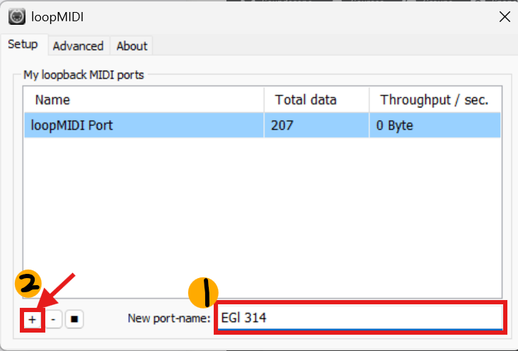

---

### Step 4: Configure REAPER (Timecode & MIDI Output)
1. Open **REAPER**. From the top menu, click **Insert** $\rightarrow$ **SMPTE LTC/MTC Timecode Generator**.  
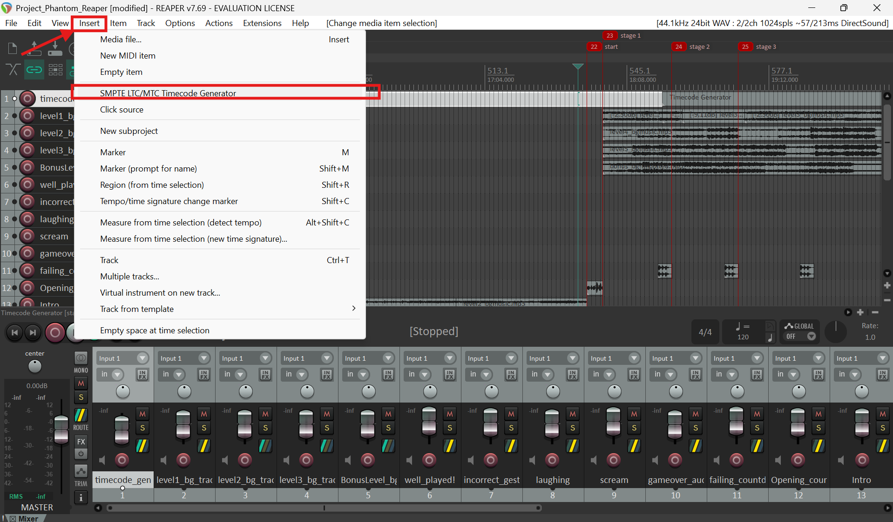

2. Press **Ctrl + P** to open Preferences. Under the **MIDI Devices** tab, make sure your MIDI setup matches your system.  
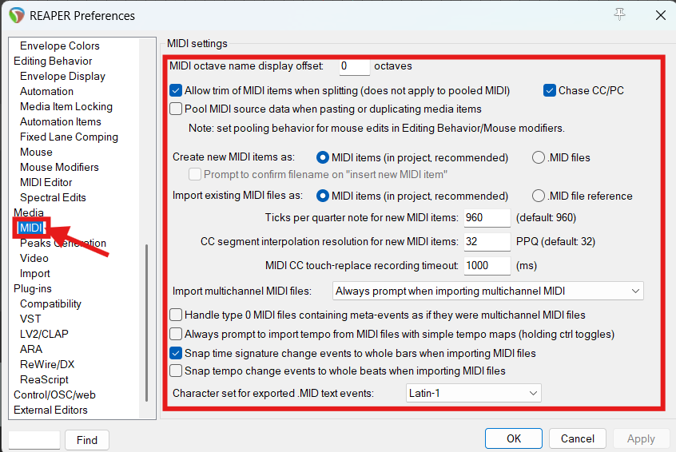

3. Under **MIDI Outputs**, double-click the new port you made in Step 3 (e.g., `L-ISA MIDI`). Enable both **Output to device** and **Send clock to device**.  
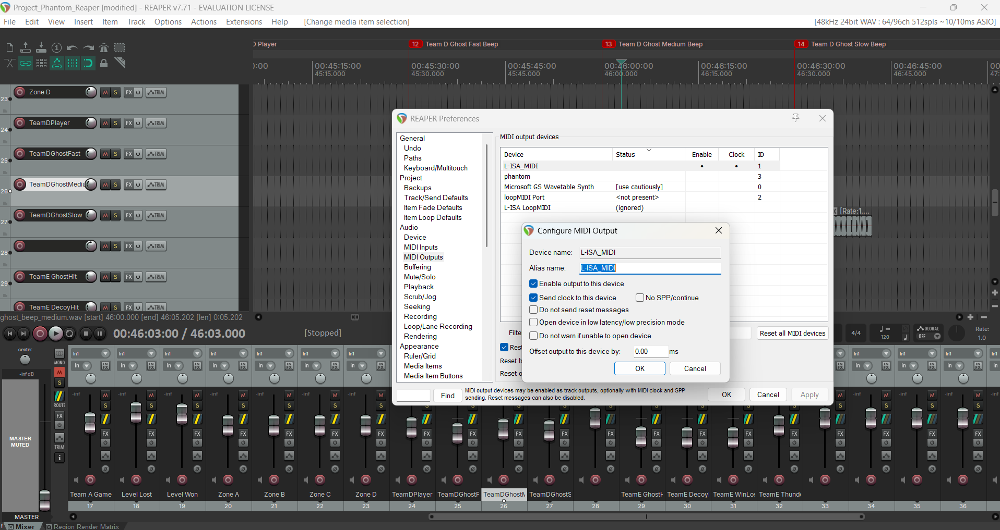  
Click **OK** when finished.

4. On your timecode track in REAPER, click the **MIDI Output** button and assign the output routing.  
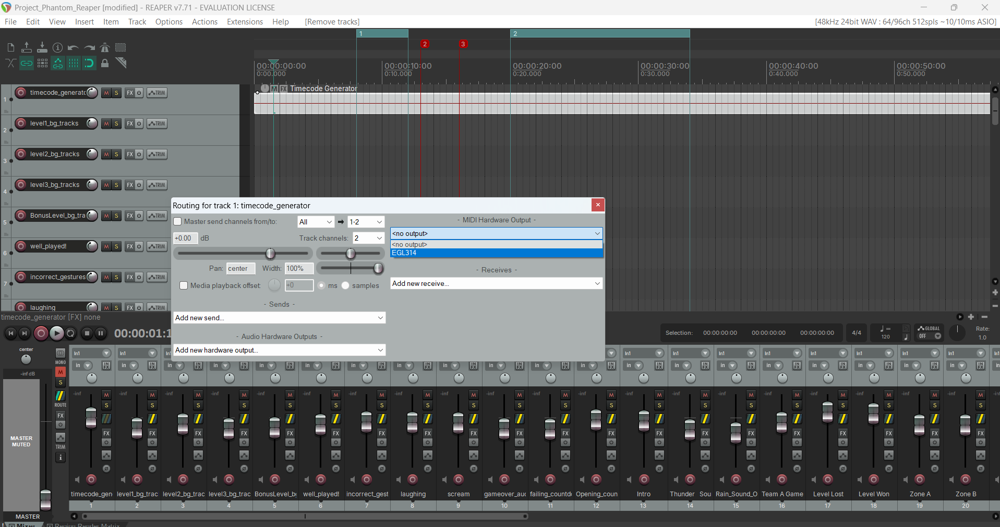

---

### Step 5: Connect Audio & MIDI Routing

#### Part A: Setting Up L-ISA Controller
1. In **L-ISA Controller**, go to **Sources** $\rightarrow$ **Overview** and add your audio sources.  
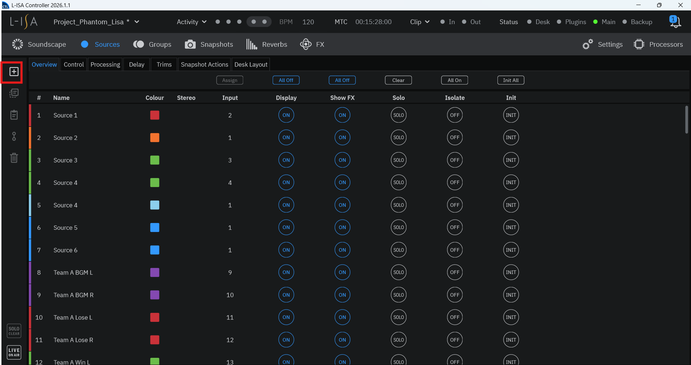

2. Double-click any source to select which audio channel it will receive sound from, then click **Save**.  
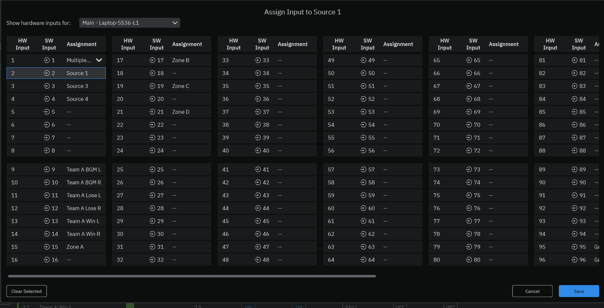

3. Go to **Sources** $\rightarrow$ **Control**. Under the **Control** column, check the boxes for the parameters you want to control with Snapshots.  
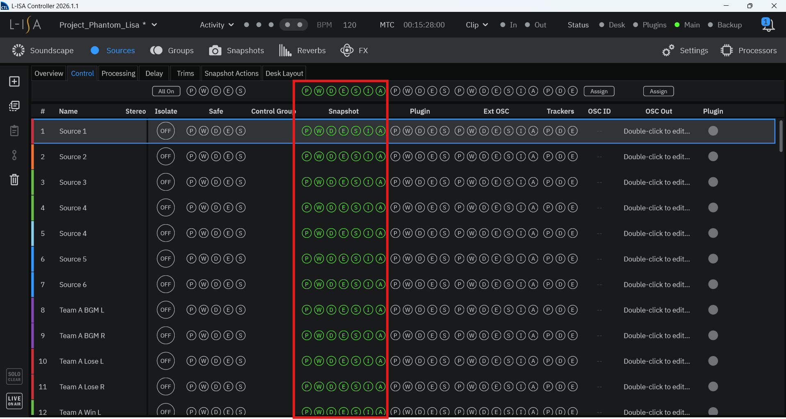
> 💡 *Note: Snapshots are saved "pictures" of where your sounds are placed in the room.*

4. Go to **MIDI** settings in L-ISA, turn MIDI on, and choose the loopMIDI port name you created earlier.  
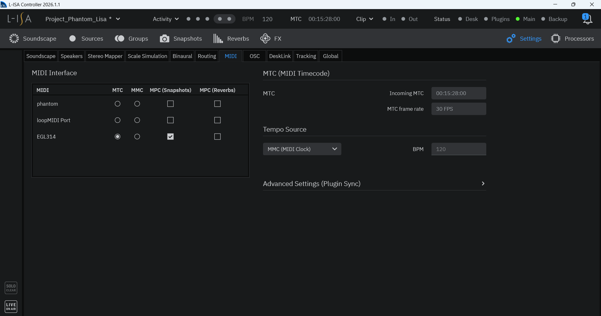

> ⚠️ **IMPORTANT:** The port name in REAPER and L-ISA must match **exactly**, including uppercase and lowercase letters (for example, `L-ISA MIDI` is not the same as `l-isa midi`).

#### Part B: Routing Tracks in REAPER
1. In REAPER, click the **`Route/MIDI Output`** button on the track you want to send.
2. Uncheck **`Send to Master Track / FX`**.
3. Choose the output destination that matches your L-ISA setup.  
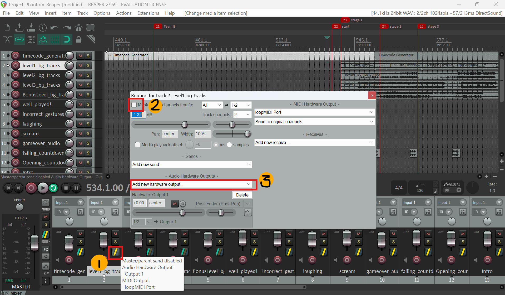

---

## Step 6: Create & Use L-ISA Snapshots
1. Drag your audio sources around the screen to set where the sound should come from in the room.  
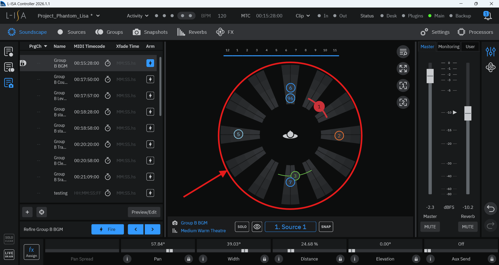

2. Use **`Fx Assign`** to create automated moving sound effects across the room.  
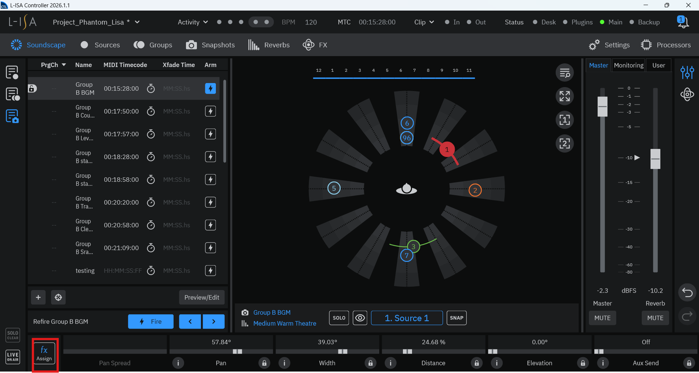

3. Click the **"+"** button to save your current setup as a **Snapshot**.  
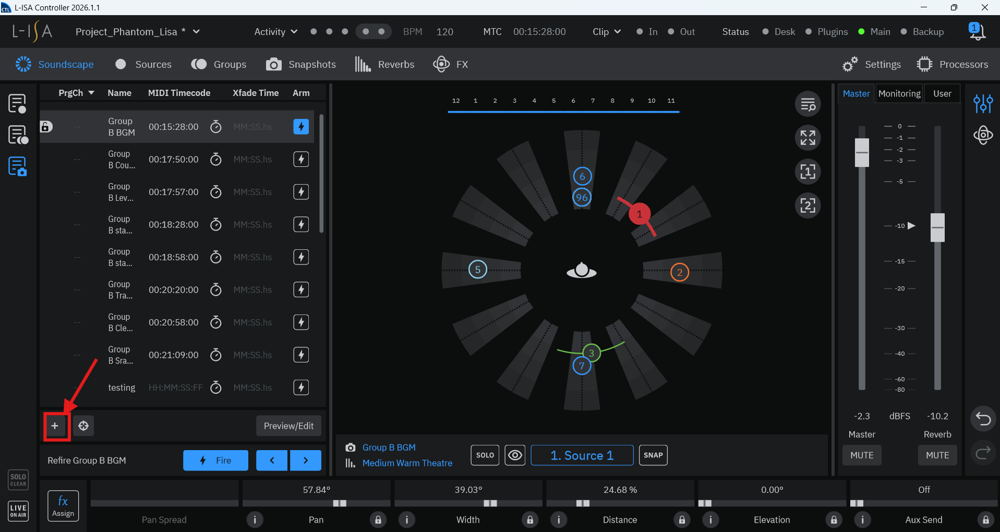

📹 **[Watch the L-ISA Snapshot Video Tutorial](https://youtu.be/_HgON7jDlwg?si=vyLm0HiD5Gl2JnPS)** for a complete step-by-step video guide.