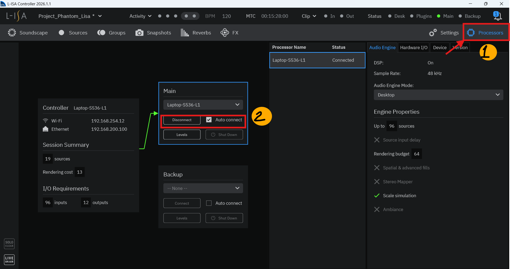
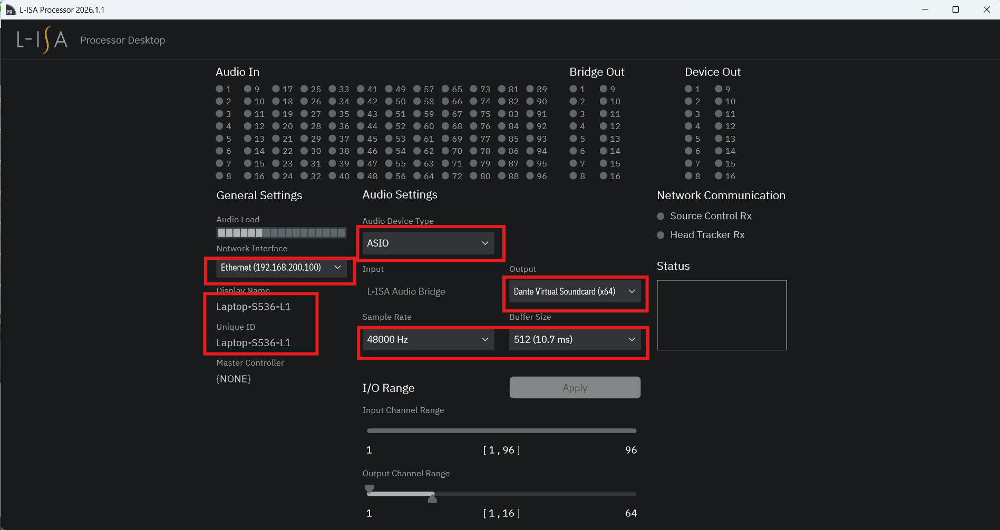
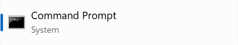
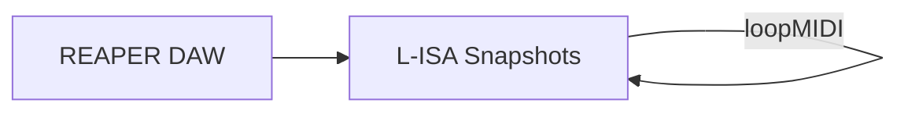

# OSC L-ISA Integration Guide

## Overview & Purpose

Controlled by REAPER during soundtrack playback, this software orchestrates room surround sound using snapshots and timecode synchronization over the MIDI Loop protocol.
---

## L-ISA Setup & Configuration

### 1. Installation

* Download and install **[L-ISA](https://www.l-acoustics.com/products/l-isa-studio/?pk_vid=86afed12eb3149cc16861759426ba57c)**, and **[loopMIDI](https://www.tobias-erichsen.de/software/loopmidi.html)**.
* 📹 **[L-ISA Video Installation & Setup Guide](https://youtu.be/eVM-51u1GbI?si=CHgpuxDxQGSGWfBy)**

### 2. L-ISA Set Up Configuration
1. Open **L-ISA Controller** and go to 'Processor', and click 'connect' and 'auto-connect'.  

2. Once done, open **L-ISA Processor** and proceed do the configuration below.  

### 3. Reaper loopMIDI Configuration
3. 
---

### Finding Your Laptop's IP Address (Windows)

1. Open **Command Prompt** (`cmd`).  

2. Type `ipconfig` and press **Enter**.  
3. Locate your active network adapter and note the **IPv4 Address**.  
(../../POC/Multiplay/Images&MultiPlay/cmd.png)

---

## Network Architecture

> ⚠️ **IMPORTANT:** Ensure the IP address and port configured in your Python scripts match the REAPER OSC network settings exactly.

---

## L-ISA Snapshots