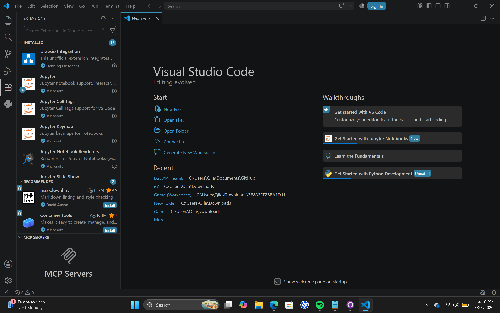

# Image Classifier on Jupyter Notebook
## Purpose
This section uses Jupyter Notebook to build and train the image classifier step-by-step. Since image models take time to load and need visual checking, the notebook allows us to view sample images directly inline, keep heavy datasets loaded in memory while tweaking settings, and inspect training results after every step.

## Software Setup
We will be adding the notebook as an extension into your Visual Studio Code for easy use! 

1. Open Visual Studio Code or Download [Visual Studio Code](https://code.visualstudio.com/sha/download?build=stable&os=win32-x64-user) (This link automatically downloads VS Code)

2. Once opened, look for extensions on the left of your screen and click on the icon. 

3. On Search Bar on left, search 'Python' and click Install. 

4. Search for Jupyter Notebook and click Install. 

5. Once installed, click the search bar on top middle and type '> Create: New Jupyter Notebook', and press Enter. 

6. A new Notebook would be created. 

7. Select your Python Kernel. Look at top right corner of screen, click 'Select Kernel'. 

8. Once clicked, choose 'Python Environments'. 

9. Select your virtual environment that is Recommended.

10. To see if Jupyter Notebook was installed properly, type `print("Hello, world!")`. Click the play icon. If successful, a tick would be shown!

Your Jupyter Notebook is good to go!

## Download of Image Classifier Folder
1. Click on ['Essential Folder'](./Essential%20Folder) and download all the files found. (Dont forget to come back to this page!)

2. Downloaded, 