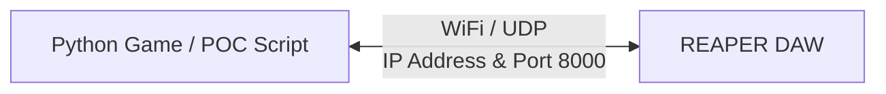
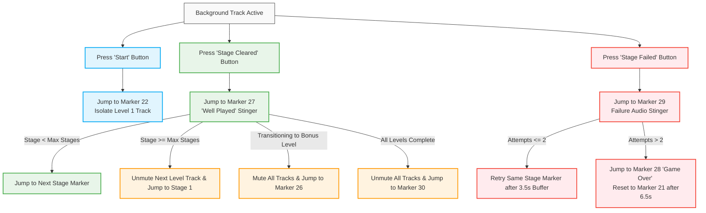

# OSC REAPER Integration Guide

## Overview & Purpose

This system leverages **OSC (Open Sound Control)** messages sent over UDP to drive real-time, multi-track audio playback inside **REAPER**. By mapping game events to REAPER action IDs and markers, the software dynamically handles:

* Multi-track audio switching (level-specific music).
* Mute/solo toggles for active audio feeds.
* Marker jumps for stingers, stage transitions, victories, and game-over sound effects.

---

## REAPER Setup & Configuration

### 1. Installation

* Download and install **[REAPER (v7.78)](https://www.reaper.fm/download.php)**.
* 📹 **[Video Installation & Setup Guide](https://www.google.com/search?q=https://youtu.be/NPRVyNZkvuU%3Fsi%3DWripKjYeM94i0ri_)**

### 2. OSC Control Surface Configuration

1. Open REAPER and press `Ctrl + P` to open **Preferences**.
2. In the left panel, navigate to **Control/OSC/web**.
3. Click **Add** to create a new control surface configuration.
4. Set **Control surface mode** to **OSC (Open Sound Control)**.
5. Apply the following settings:
* **Mode:** `Configure device IP+local port`
* **Local listen port:** `8000` *(This is the port REAPER listens on for incoming OSC messages)*.
* **Device IP:** Set to broadcast IP `0.0.0.0`.
* **Local IP:** Displays your machine's current local IP.
* **Action Binding:** Check **"Allow binding messages to REAPER actions and FX learn"** so OSC messages can trigger custom actions and markers.


6. Click **OK** to save and apply.

---

### Finding Your Laptop's IP Address (Windows)

1. Open **Command Prompt** (`cmd`).
2. Type `ipconfig` and press **Enter**.
3. Locate your active network adapter and note the **IPv4 Address**.

---

## Network Architecture



> ⚠️ **IMPORTANT:** Ensure the IP address and port configured in your Python scripts match the REAPER OSC network settings exactly.

---

## Standalone Simulation (`GAME_SIMULATION.py`)

Before running production code, `GAME_SIMULATION.py` serves as a standalone GUI testing environment built with `tkinter` and `pythonosc` to verify OSC network commands and REAPER marker jumps.

### Core Script Logic & State Management

#### 1. Imports & Dependencies

```python
import threading
import tkinter as tk
from pythonosc import udp_client

```

#### 2. Level, Stage, and Action ID Mappings

```python
current_level = 1
stage_failed = 0
stage_cleared = 0

# Maps game levels to REAPER custom action IDs (unmutes level track & mutes others)
LEVEL_MAP = {
    1: "_b5b9b1aa3433a54f8efb7058fd9dc212",  # Unmute Level 1 track
    2: "_8003a43cdba0624b948270f6b5224ee8",  # Unmute Level 2 track
    3: "_fed26a77af3cb841b8ae1156e64de1ec",  # Unmute Level 3 track
    4: "_82a10b90ef7428438ddfd101c8195d19"   # Unmute Bonus Level track
}

# Maximum required stages before advancing to the next level
MAX_STAGES_PER_LEVEL = {
    1: 2,  # Level 1 -> 2 stages
    2: 2,  # Level 2 -> 2 stages
    3: 2,  # Level 3 -> 2 stages
    4: 3   # Level 4 (Bonus) -> 3 stages
}

# REAPER Action IDs for stage markers
STAGE_MARKER_MAP = {
    1: "41263",  # Marker 23 (Stage 1)
    2: "41264",  # Marker 24 (Stage 2)
    3: "41265"   # Marker 25 (Stage 3 / Bonus)
}

```

#### 3. Initialization & Start Sequence

```python
# Jump to Marker 21 (Standby/Lobby track)
send_message(PI_A_ADDR, REAPER_PORT, "/action/41261", 1.0)

# Start playback (REAPER Action 40044: Transport Play/Stop)
send_message(PI_A_ADDR, REAPER_PORT, "/action/40044", 1.0)

# On 'Start' button press: Jump to Marker 22 (Countdown) & isolate Level 1 track
send_message(PI_A_ADDR, REAPER_PORT, "/action/41262", 1)
send_message(PI_A_ADDR, REAPER_PORT, "/action/_b5b9b1aa3433a54f8efb7058fd9dc212", 1)

```

#### 4. Event Handler Functions

```python
def jump_to_stage(level, stage_number):
    """Jumps to a specific stage marker and unmutes the corresponding level track."""
    marker_action = STAGE_MARKER_MAP.get(stage_number, "41263")
    print(f"⌛ Buffer complete! Transitioning to Level {level}, Stage {stage_number}...")
    
    # Jump to stage marker in REAPER
    send_message(PI_A_ADDR, REAPER_PORT, f"/action/{marker_action}", 1)
    
    # Apply level track state
    if level in LEVEL_MAP:
        send_message(PI_A_ADDR, REAPER_PORT, f"/action/{LEVEL_MAP[level]}", 1)

def retry_stage(level, stage_number):
    """Retries the current stage following a failure attempt."""
    marker_action = STAGE_MARKER_MAP.get(stage_number, "41263")
    print(f"🔄 Retrying Level {level}, Stage {stage_number}...")
    
    send_message(PI_A_ADDR, REAPER_PORT, f"/action/{marker_action}", 1)
    if level in LEVEL_MAP:
        send_message(PI_A_ADDR, REAPER_PORT, f"/action/{LEVEL_MAP[level]}", 1)

def back_to_start():
    """Resets audio sequence back to the standby marker (Marker 21)."""
    print("⌛ Buffer complete! Returning to lobby.")
    send_message(PI_A_ADDR, REAPER_PORT, "/action/41261", 1)

```

---

### Simulation Event Flowchart



---

## Production Integration

### 1. Client Setup & Utility Functions

```python
from pythonosc import udp_client

REAPER_LAPTOP_IP = "192.168.254.238" 
REAPER_PORT = 8000  

def create_osc_client(ip, port, system_name="REAPER"): 
    try: 
        client = udp_client.SimpleUDPClient(ip, port)
        print(f"[+] OSC ready -> {system_name} on {ip}:{port}")
        return client
    except Exception as e:
        print(f"[!] Network Pipeline Failed for {system_name}: {e}")
        return None

def send_osc_signal(client, address, message=1):
    if client is None: 
        return
    try: 
        client.send_message(address, float(message))
    except Exception as e: 
        print(f"[!] Failed to send OSC message {address}: {e}")

```

### 2. Primary Event Commands Summary

| Game Event | Description | OSC Address / Action ID |
| :--- | :--- | :--- |
| **System Initialization** | Exit loop, jump to lobby (Marker 21), and begin playback | `/action/40339`<br>`/action/41261`<br>`/action/40044` |
| **Start Game** | Jump to countdown (Marker 22) and isolate Level 1 music | `/action/41262`<br>`/action/_b5b9b1aa3433a54f8efb7058fd9dc212` |
| **Stage Clear (Intermediate)** | Mute music tracks and play victory stinger (Marker 27) | `/action/_b4dd8381edb3cf4a82f2f1d2a56622e0`<br>`/action/41267` |
| **Bonus Level Transition** | Trigger transition marker (Marker 26) and prep Bonus Track | `/action/_b4dd8381edb3cf4a82f2f1d2a56622e0`<br>`/action/41266` |
| **Life Lost / Single Attempt Fail** | Mute music and trigger fail stinger (Marker 29) | `/action/41269`<br>`/action/_b4dd8381edb3cf4a82f2f1d2a56622e0` |
| **Hard Defeat (Game Over)** | Trigger hard game over track (Marker 28) | `/action/41268`<br>`/action/_b4dd8381edb3cf4a82f2f1d2a56622e0` |
| **Full Game Victory** | Unmute all tracks and trigger victory sequence (Marker 30) | `/action/_7f4e8ad275963d4c8547d96d2538d0be`<br>`/action/41270` |
| **Emergency Stop (`ESC` / `q`)** | Immediately halt all audio playback | `/action/1016` |

### 3. Custom Command ID Used
| Action ID / Command | Description |
| :--- | :--- |
| `_b4dd8381edb3cf4a82f2f1d2a56622e0` | Mute all music tracks |
| `_b5b9b1aa3433a54f8efb7058fd9dc212` | Unmute Track 2 only (Level 1) |
| `_8003a43cdba0624b948270f6b5224ee8` | Unmute Track 3 only (Level 2) |
| `_fed26a77af3cb841b8ae1156e64de1ec` | Unmute Track 4 only (Level 3) |
| `_82a10b90ef7428438ddfd101c8195d19` | Unmute Track 5 only (Bonus) |
| `_7f4e8ad275963d4c8547d96d2538d0be` | Unmute all tracks |