# OSC Reaper Guide

## Purpose

Driven by OSC commands, the software enables simultaneous multi-track playback, utilizing markers along with mute and solo controls to govern active audio feeds.

## Configuration and Setup

1. Download [Reaper Version 7.78](https://www.reaper.fm/download.php).
[![Here's the video/installation guide]](https://youtu.be/NPRVyNZkvuU?si=WripKjYeM94i0ri_)](https://youtu.be/NPRVyNZkvuU?si=WripKjYeM94i0ri_)
2. Once downloaded, press Ctrl + P to go to **preferences**.
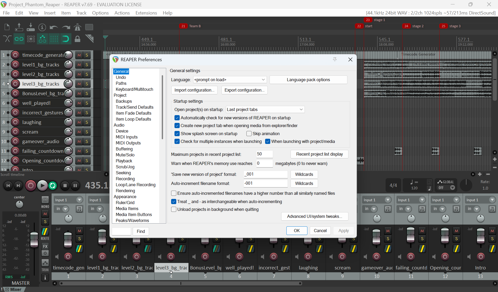
3. Once you're in preferances, go to OSC/Web/Control
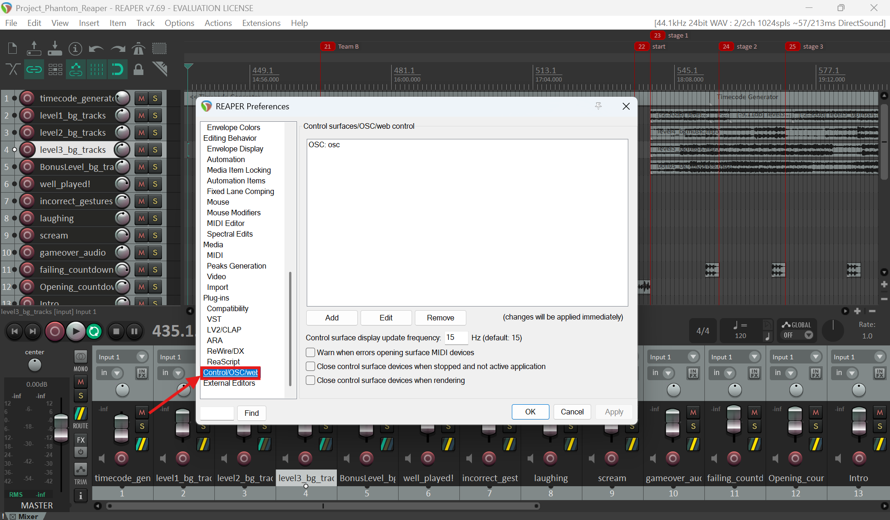
4. Click "Add", to add osc configuration.
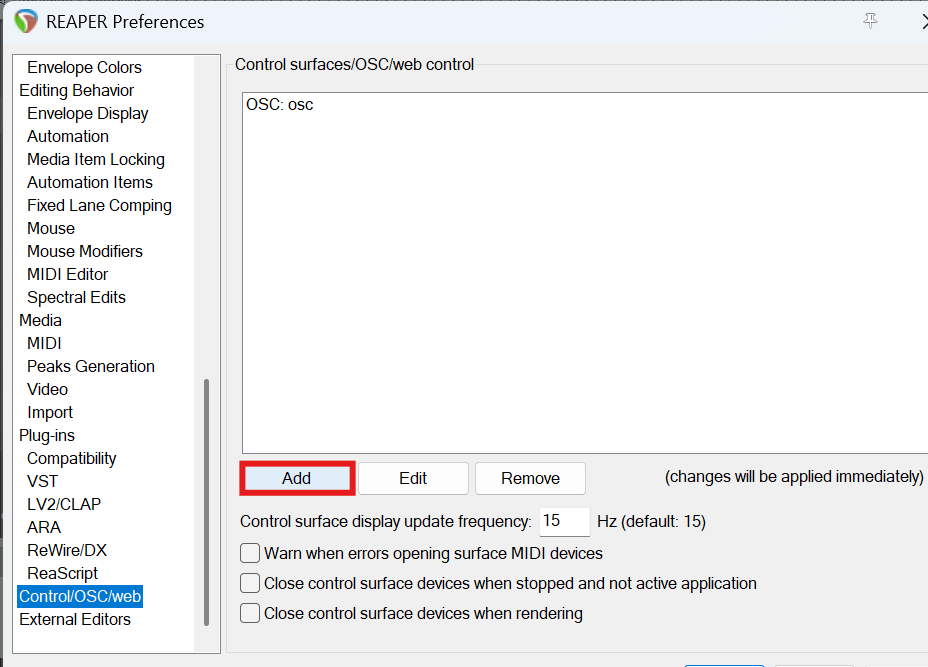
5. In Control Surface Setting, click the drop down button and select "OSC (Open Sound Control)"
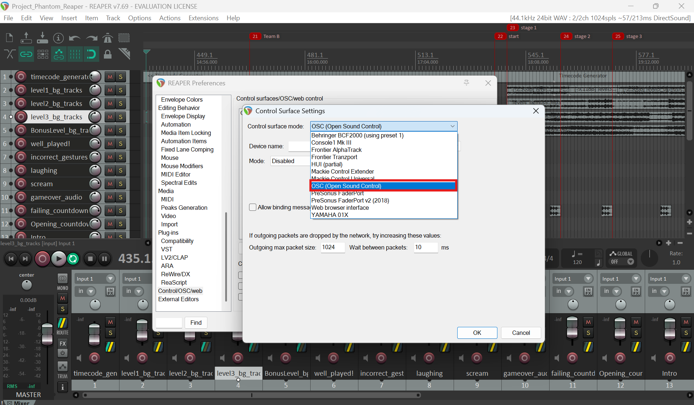
6. Under the OSC Control configurations:
* Edit the device name. Under mode, select "configure devices IP+local port". 
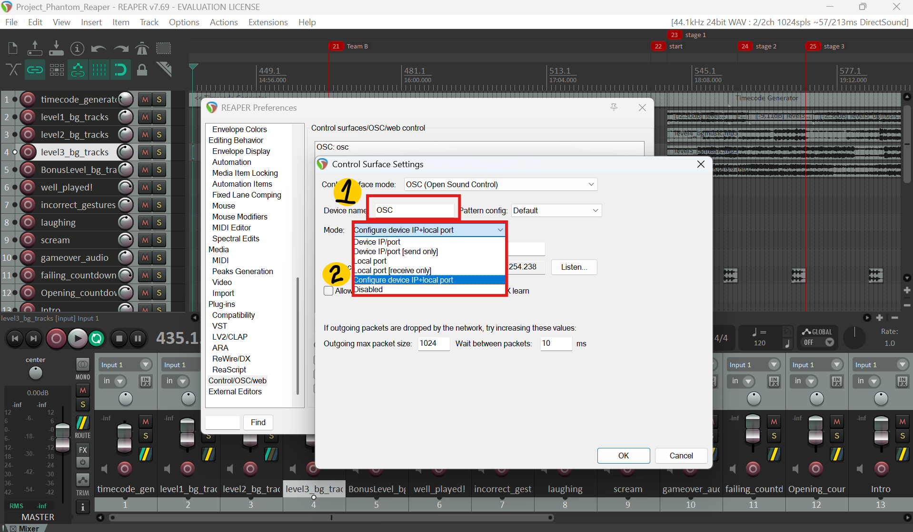
* Once mode is selected, edit local listen port to **8000**.
> Listen port is for OSC to send which reaper software to control
* Once done, make sure the device IP is in the Boardcast IP address "0.0.0.0", while Local IP is the same as your Laptop IP.
* Check "Allow binding messages to REAPER actions and FX learn" for OSC to communicate commands to REAPER software.
7. Once all the configurations are done, click "OK".
Here's the image of how the step-by-step configuration looks like on the software.
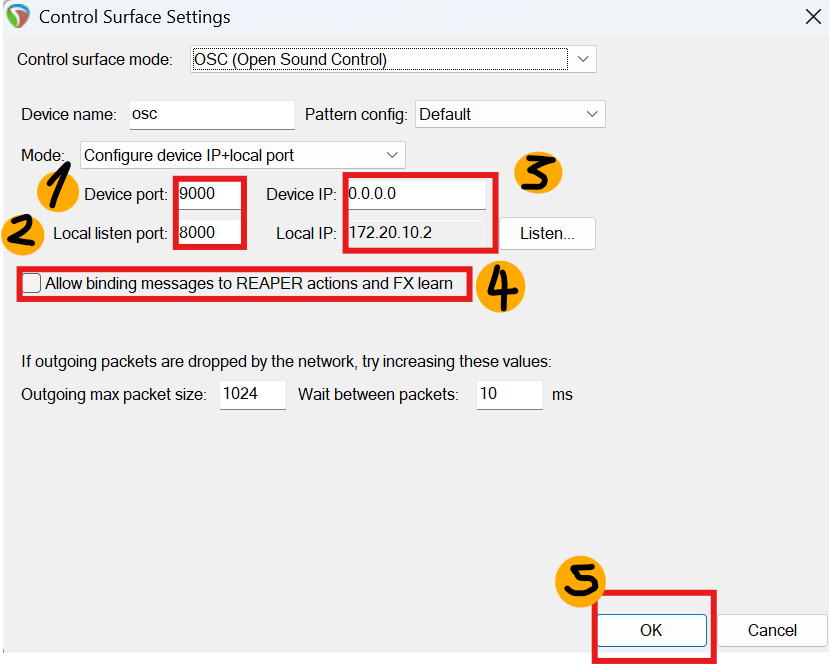

### Finding Your Laptop's IP Address

1. Open the **Command Prompt** (cmd) on your Windows machine. <br>

2. Type `ipconfig` and press **Enter**. Your IPv4 address will be listed under your active network adapter.


---

## Architecture Flowchart

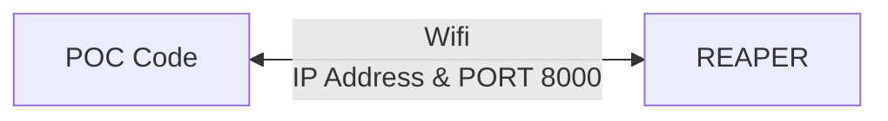

> ⚠️ **DISCLAIMER:** > Ensure that the IP address and Port configured inside your POC Python script perfectly match the settings applied in REAPER!

---

## Dummy Game Simulation

Before implementing the production code, `GAME_SIMULATION.py` was built as a standalone simulation to ensure the Network/OSC communication pipeline functions properly.

```python
GAME_SIMULATION.py
```

This is how the GAME_SIMULATION look like:
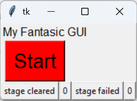

### Script Logic Breakdown

1. **GUI Engine:** Import `tkinter` to render the test control window.
```python
import tkinter as tk
```

2. **Network Protocol:** "from pythonosc import udp_client" to import OSC commands to REAPER over standard UDP packets.
```python
from pythonosc import udp_client
```

3. **Execution Interface:** Running the script initializes a control panel pop-up window:

4. Reaper will start playing at Marker 21.

5. When the "Start" button is pressed, OSC commands Reaper to jump at 'Marker 22', playing the 'countdown' track before starting level 1 track (a custom command id was made to mute all the level music tracks except the current level track that the players are playing).
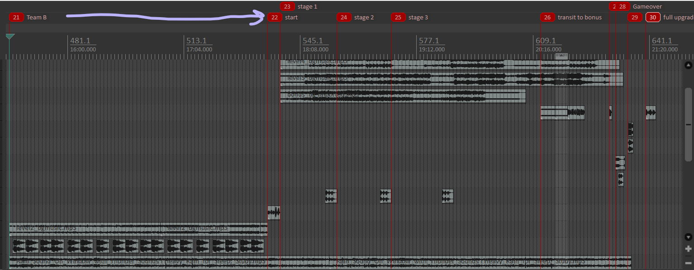
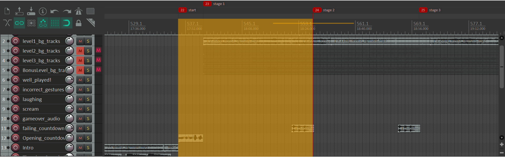

6. If players managed to clear the stage within 30s, user can press the "stage_cleared" button to simulate stage_clear in the game. Once "stage_cleared" button is pressed, OSC commands Reaper to jump at 'Marker 27' with an audio track saying "Well played".
If stage_cleared is pressed before the last stage of the level, OSC will command Reaper to jump to the next stage marker after Marker 27 is played.
If stage_cleeared is pressed after the last stage of the level, OSC will command Reaper to jump back to 'stage 1' (Marker 23), mute the previous track, unmuting the next track.
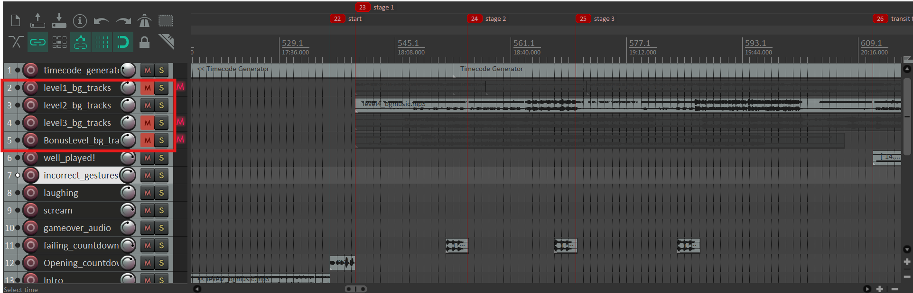

7. However, if players did not clear the stage after 30s, user can press the "stage_failed" button to simulate player failing the current level/stage they are in. Once "stage_failed" button is pressed, OSC commands Reaper to jump at 'Marker 29' with the thunder and laughing audio track.
If the button is pressed less than 3 times, it will jump to the current stage that users failed to pass the stage.
If the button is pressed more than 2 times, it will jump to 'Marker 28', playing the 'Gameover' Track for 5s, before jumping back to 'Marker 21'.

```mermaid
graph LR
 A[Start Button Pressed] --> B[GAME_SIMULATION.py sends command]
 B --> C[Reaper Goes To <br> A Specific Marker] --> D[Reaper plays the sound track(s)]

```

> 📌 *Note: The core design maps Level numbers directly to the last digit of the command id (e.g., Level 1 = Cue 1, Level 2 = Cue 2).*


#### REAPER LEVEL and STAGE Tracking

```python
current_level = 1
stage_failed = 0
stage_cleared = 0
LEVEL_MAP = {
    1: "_b5b9b1aa3433a54f8efb7058fd9dc212",  # level 1 track unmuted only
    2: "_8003a43cdba0624b948270f6b5224ee8",  # Level 2 track unmuted only
    3: "_fed26a77af3cb841b8ae1156e64de1ec",  # level 3 track unmuted only
    4: "_82a10b90ef7428438ddfd101c8195d19"   # bonus track unmuted only
}

MAX_STAGES_PER_LEVEL = {
    1: 2,  # Level 1 has 2 stages
    2: 2,  # Level 2 has 2 stages
    3: 2,  # Level 3 has 2 stages
    4: 3   # Bonus Level 4 has 3 stages
}

# REAPER Action IDs for stage markers
STAGE_MARKER_MAP = {
    1: "41263",  # Marker 23 (Stage 1)
    2: "41264",  # Marker 24 (Stage 2)
    3: "41265"   # Marker 25 (Stage 3 / Bonus)
}

```

#### Comprehensive Event Flow Layout

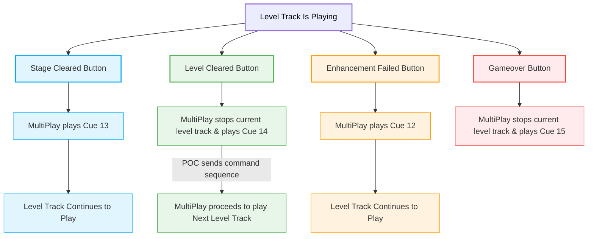

---

## Production POC Code Integration

1. **Environment Configuration:** Network variables must match your target system's parameters:
```python
REAPER_LAPTOP_IP = "192.168.254.238" 
REAPER_PORT      = 8000  

```

2. **Network Handshake & Output Pipeline:** Wrapper functions handle connection dropouts and signal tracking cleanly.
```python
def create_osc_client(ip, port, system_name): 
    try: 
        client = udp_client.SimpleUDPClient(ip, port)
        print(f"[+] OSC ready -> {system_name} on {ip}:{port}")
        return client
    except Exception as e:
        print(f"[!] Network Pipeline Failed for {system_name}: {e}")
        return None

def send_osc_signal(client, address, message):
    if client is None: 
        return
    try: 
        client.send_message(address, message)
    except Exception: 
        pass 

```


3. **Initialization:** When a player presses `
```python

```


4. **Life Loss Warning:** If a player loses a life, a failure warning layout is triggered dynamically via `Marker 29`. *(Lines)*
```python
send_osc_signal(reaper_client, "", 1)

```


5. **Defeat Handling:** Losing all 3 structural player lives switches focus entirely to the global defeat array via `Marker 28`. *(Lines)*
```python
send_osc_signal(reaper_client, "/action/41269", 1)

```


6. **Dynamic Multi-Level Sequencing:** As game logic increments, variables adjust smoothly to handle indexing. *(Line 573)*
* Example: If `current_level = 1`, system targets `cue 1`. If stepped up to `2`, tracking references `cue 2`.


```python
current_level += 1
current_cycle = 0
game_status, status_display_time = "WIN", current_time
send_osc_signal(multiplay_client, f"/cue/{current_level}/go", 1)
send_osc_signal(multiplay_client, "/cue/14/go", 1)

```


7. **Hard System Interruption:** Pressing escape keys (`ESC` or `q`) kills active channels immediately upon termination. *(Line 625)*
```python
if key == ord('q') or key == 27: 
     send_osc_signal(multiplay_client, f"/cue/{current_level}/stop", 1)
     send_osc_signal(multiplay_client, "/cue/7/stop", 1)

```


> *Note: Cue 7 references a hidden bonus track asset. It is called out by name explicitly rather than utilizing standard incremental level variables.*
