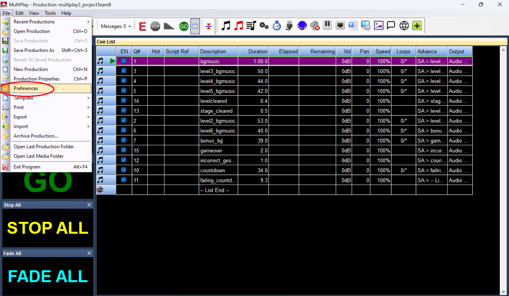
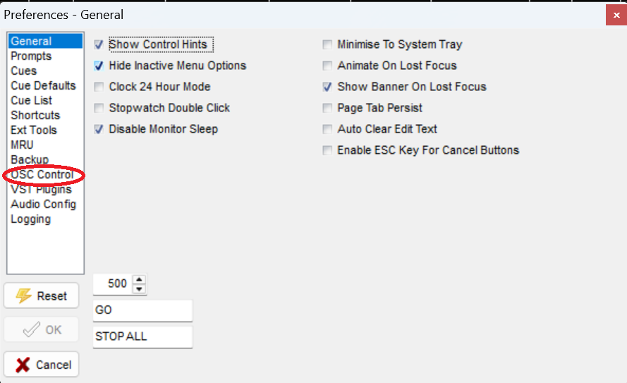
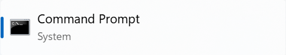

# OSC MultiPlay3

## Purpose
This software allows the track to play one or more audio tracks at any time, enhancing players' experience with different sound effects.

## Configuration and set up
1. Download [MultiPlay3 Version 3.0.50.0](https://da-share.com/forum/index.php?topic=74.0)

2. Once downloaded, allow/agree all preferences and options before launching the software.

3. In MultiPlay, under file, click ```Preferences```.

   

4. Then, go to ```OSC Control``` tab.

    

6. Under OSC Control, select your ```laptop's IP Address``` first before enabling ```Control (Incoming)``` and change the port number to```8000```.
    <br> *This is to allow MultiPlay to receive commands from the POC code*
   
   
   <br> Once done, click **OK**.
   
### To find out your laptop's ip address
1. Go to ```Command Prompt```.

   

3. Type ```ipconfig```

   


## Flow Chart

> **DISCLAIMER:
MAKE SURE THE POC CODE HAS THE SAME PORT AND IP ADDRESS IN THE MULTIPLAY3!**

## Dummy Game
Before implementing the POC Code to control the cues in MultiPlay, ~/dummy_game was another game simulation to make sure the code is working.

````
dummy_game.py
````
## Expectations
1. When user pressed the "level 1" button, cue 1 in MultiPlay will start playing, frozing all the level buttons in the tkinter.
   <br> *This is for the game tester to jump into different level for checking purpose without having to declare the level itself*
   ```mermaid
   graph LR
    A[Level 1 Button Pressed] --> B[dummy_game.py sends <br> command]
    B --> C[MultiPlay Plays Cue 1]
   ```
   > *Note: Level number and cue track are the same number. Eg. Level 1 = cue 1, Level 2 = cue 2*
   
2. As the level sound track is playing, user can pressed the second row buttons.
   <br>
   a. staged cleared - *the button can be **pressed multiple times** as the level track is playing (when player passed the stage)* <br><br>
   b. level cleared - *the code will send command to MultiPlay to play the **next level sound track*** <br><br>
   c. Enchantment failed - *the button can be **pressed multiple times** as the level track is playing (user is failling the stage)* <br><br>
   d. Gameover - *the code will send command to MultiPlay to **stop all** sound track* <br>
   ```mermaid
   graph TD
    A[Level Track <br> Is Playing] --> B[Stage Cleared Button]
    B --> C[MultiPlay plays cue 13]
    C --> D[Level Track Continues <br> to Play]

    A --> E[Level Cleared Button]
    E --> F[MultiPlay stops current <br> level track, and <br> plays cue 14]
    F -->|POC sends commands to <br> Multiplay| G[MultiPlay Proceeds To Play <br> The Next Level Track]

    A --> H[Enhancement <br> Failed Button]
    H --> I[MultiPlay plays cue 13]
    I --> J[Level Track Continues <br> to Play]

    A --> K[Gameover Button]
    K --> L[MultiPlay stops current <br> level track, <br> and plays cue 15]

   %% ==========================================
    %% COLOR STYLING SCRIPT
   %% ==========================================
    
   %% Main Start Box (Gray/Blue)
    style A fill:#ECECFF,stroke:#9370DB,stroke-width:2px,color:#000
   
   %% Branch 1: Stage Cleared (Light Green)
    style B fill:#E1F5FE,stroke:#03A9F4,stroke-width:2px
    style C fill:#E1F5FE,stroke:#03A9F4,stroke-width:1px
    style D fill:#E1F5FE,stroke:#03A9F4,stroke-width:1px

    %% Branch 2: Level Cleared (Bright Green Success)
    style E fill:#E8F5E9,stroke:#4CAF50,stroke-width:2px
    style F fill:#E8F5E9,stroke:#4CAF50,stroke-width:1px
    style G fill:#E8F5E9,stroke:#4CAF50,stroke-width:1px

    %% Branch 3: Enhancement Failed (Orange/Yellow Warning)
    style H fill:#FFF3E0,stroke:#FF9800,stroke-width:2px
    style I fill:#FFF3E0,stroke:#FF9800,stroke-width:1px
    style J fill:#FFF3E0,stroke:#FF9800,stroke-width:1px

    %% Branch 4: Gameover (Red Danger)
    style K fill:#FFEBEE,stroke:#F44336,stroke-width:2px
    style L fill:#FFEBEE,stroke:#F44336,stroke-width:1px
   ```
## The Desired Results in the POC Code
1. When player pressed "S", POC Code will play cue 1.
2. Every level has a audio track in the MultiPlay
    <br> eg. Level 1 will play cue 1 play on MultiPlay, level 2 will play cue 2 on MultiPlay
4. If players lose a life, cue 12 will be played, alerting user that they have lost a life.
5. If players lose all 3 lives, cue 15 will be played to indicate that they have lost the game.
6. If players managed to passed the stage(s), cue 13 will be played, alerting players that they have passed the stage.
7. After passing 3 stages, cue 14 will be played for players to know that they have passed onto the next level.
8. Once the next level is played, the POC Code will run the next "current level" audio track. 
    eg. current_level is 1, multiplay will play cue 1
        if the next current_level is 2, multiplay will play cue 1.
9. Once game has ended, no cue(s) will be playing.

