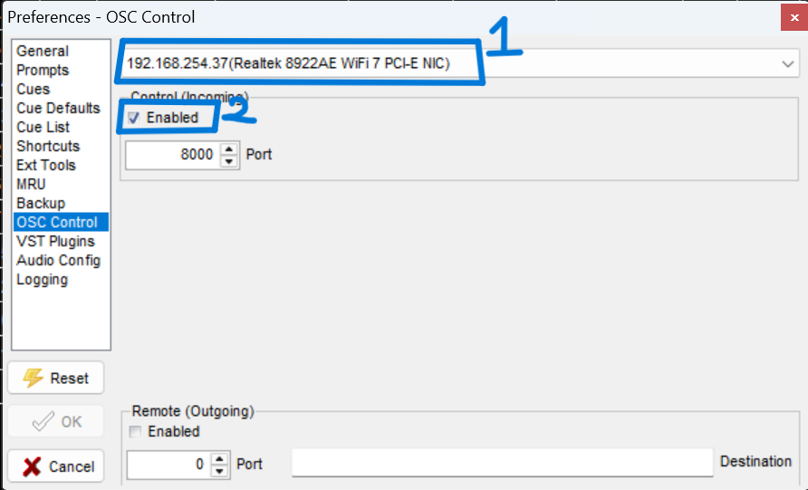
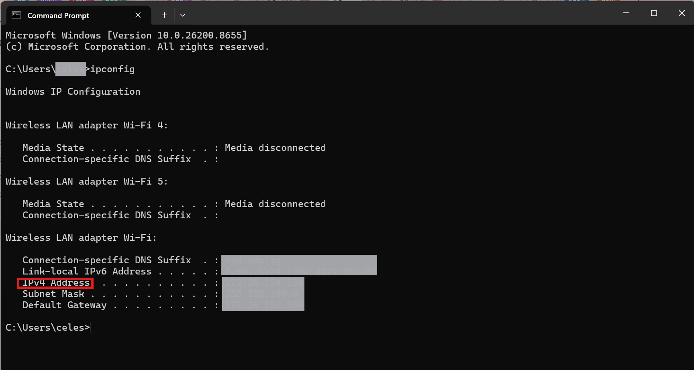
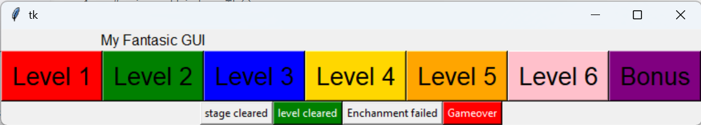

# OSC MultiPlay3

## Purpose
This software allows the track to play one or more audio tracks at any time, enhancing players' experience with different sound effects.

## Configuration and set up
1. Download [MultiPlay3 Version 3.0.50.0](https://da-share.com/forum/index.php?topic=74.0)

2. Once downloaded, allow/agree all preferences and options before launching the software.

3. In MultiPlay, under file, click ```Preferences```.

   

4. Then, go to ```OSC Control``` tab.

    

6. Under OSC Control, select your ```laptop's IP Address``` first before enabling ```Control (Incoming)``` and change the port number to```8000```.
    <br> *This is to allow MultiPlay to receive commands from the POC code*
   
   
   <br> Once done, click **OK**.
   
#### To find out your laptop's ip address
1. Go to ```Command Prompt```.

   

2. Type ```ipconfig```. You will find your laptop's ip address immediately.

   


## Flow Chart

> **DISCLAIMER:
MAKE SURE THE POC CODE HAS THE SAME PORT AND IP ADDRESS IN THE MULTIPLAY3!**

## Dummy Game
Before implementing the POC Code to control the cues in MultiPlay, ~/dummy_game was another game simulation to make sure the code is working.

````
dummy_game.py
````

#### dummy_game.py Explained
1. Import ```tkinter``` for the game simulation
    ```bash
   import tkinter as tk
   ```
2. Import socket to send OSC commands to MultiPlay through UDP
    ```bash
   import socket
   ```
3. When the python is run, you will see a Window Pop-up as the image was shown below.
   

4. When user pressed the "level 1" button, cue 1 in MultiPlay will start playing, frozing all the level buttons in the tkinter.
   <br> *This is for the game tester to jump into different level for checking purpose without having to declare the level itself*

   ```mermaid
   graph LR
    A[Level 1 Button Pressed] --> B[dummy_game.py sends <br> command]
    B --> C[MultiPlay Plays Cue 1]
   ```
   > *Note: Level number and cue track are the same number. Eg. Level 1 = cue 1, Level 2 = cue 2*
   
   #### Buttons froze when level button is pressed
   ```bash
   current_level = 1

   def set_all_buttons_state(new_state):
      """
      Loops through our list of 7 color buttons and changes their state.
      """
      global all_level_buttons
      for button in all_level_buttons:
         button.config(state=new_state)
   ```
   #### Code for Multiplay to play the level cue
   ```bash
   def pressed(audio_track_level):
    global n
    global current_level  
    
    n = audio_track_level
    print(f"The audio track is {n}")

    # --- 1. SMART MANUAL CUE BUTTONS (Handles 0 to 6 automatically) ---
    if 0 <= n <= 6:
        # If n is between 0 and 6, we calculate the tracks dynamically:
        if n > 0:
            send_message(IP, PORT, f"/cue/{n}/stop") # Stops the previous track
            
        current_level = n + 1                       # Math sets the exact level
        send_message(IP, PORT, f"/cue/{current_level}/go") # Starts the new track

        set_all_buttons_state(tk.DISABLED)
   ```
   
5. As the level sound track is playing, user can pressed the second row buttons.
   <br>
   a. staged cleared - *the button can be **pressed multiple times** as the level track is playing (when player passed the stage)* <br>
   ```bash
   elif n == 13:                               # stage cleared
        send_message(IP, PORT, "/cue/13/go") 
   ```
   b. level cleared - *the code will send command to MultiPlay to play the **next level sound track*** <br>
   ```bash
   elif n == 14:                               # level cleared
        send_message(IP, PORT, "/cue/14/go")    # Play victory sting
        send_message(IP, PORT, f"/cue/{current_level}/stop") # Stop the current level

        current_level += 1                      # Move up exactly 1 level
        send_message(IP, PORT, f"/cue/{current_level}/go")   # Play the next level
   ```
   However, another condition was added for tkinter to unfroze all the buttons once game ended/completed.
   ```bash
   if current_level > 7:
            set_all_buttons_state(tk.NORMAL)
   ```
   c. Enhancement failed - *the button can be **pressed multiple times** as the level track is playing (user is failing the stage)* <br>

   ```bash
   elif n == 12:                               # incorrect hand gesture
        send_message(IP, PORT, "/cue/12/go")  
   ```
   d. Gameover - *the code will send command to MultiPlay to **stop all** sound track* <br>
   ```bash
   elif n == 15:                               # Gameover
        send_message(IP, PORT, "/cue/15/go")    # Then sends the go
        send_message(IP, PORT, f"/cue/{current_level}/stop")
        set_all_buttons_state(tk.NORMAL)
   ```
   *Note: "if else" condition was added for the event buttons to happened*

   ```mermaid
   graph TD
    A[Level Track <br> Is Playing] --> B[Stage Cleared Button]
    B --> C[MultiPlay plays cue 13]
    C --> D[Level Track Continues <br> to Play]

    A --> E[Level Cleared Button]
    E --> F[MultiPlay stops current <br> level track, and <br> plays cue 14]
    F -->|POC sends commands to <br> Multiplay| G[MultiPlay Proceeds To Play <br> The Next Level Track]

    A --> H[Enhancement <br> Failed Button]
    H --> I[MultiPlay plays cue 13]
    I --> J[Level Track Continues <br> to Play]

    A --> K[Gameover Button]
    K --> L[MultiPlay stops current <br> level track, <br> and plays cue 15]

   %% ==========================================
    %% COLOR STYLING SCRIPT
   %% ==========================================
    
   %% Main Start Box (Gray/Blue)
    style A fill:#ECECFF,stroke:#9370DB,stroke-width:2px,color:#000
   
   %% Branch 1: Stage Cleared (Light Green)
    style B fill:#E1F5FE,stroke:#03A9F4,stroke-width:2px
    style C fill:#E1F5FE,stroke:#03A9F4,stroke-width:1px
    style D fill:#E1F5FE,stroke:#03A9F4,stroke-width:1px

    %% Branch 2: Level Cleared (Bright Green Success)
    style E fill:#E8F5E9,stroke:#4CAF50,stroke-width:2px
    style F fill:#E8F5E9,stroke:#4CAF50,stroke-width:1px
    style G fill:#E8F5E9,stroke:#4CAF50,stroke-width:1px

    %% Branch 3: Enhancement Failed (Orange/Yellow Warning)
    style H fill:#FFF3E0,stroke:#FF9800,stroke-width:2px
    style I fill:#FFF3E0,stroke:#FF9800,stroke-width:1px
    style J fill:#FFF3E0,stroke:#FF9800,stroke-width:1px

    %% Branch 4: Gameover (Red Danger)
    style K fill:#FFEBEE,stroke:#F44336,stroke-width:2px
    style L fill:#FFEBEE,stroke:#F44336,stroke-width:1px
   ```

## In the POC Code
1. ```MULTIPLAY_LAPTOP_IP``` and ```MULTIPLAY_PORT``` was added based on the configuration you have done.
   ```bash
   MULTIPLAY_LAPTOP_IP = "192.168.254.238" 
   MULTIPLAY_PORT      = 8000  
   ```  
2. ```create_osc_client``` and ```send_osc_signal``` functions were used to send python commands from Visual Studio Code to MultiPlay.

   ```bash
   def create_osc_client(ip, port, system_name): 
    try: 
        client = udp_client.SimpleUDPClient(ip, port)
        print(f"[+] OSC ready -> {system_name} on {ip}:{port}")
        return client
    except Exception as e:
        print(f"[!] Network Pipeline Failed for {system_name}: {e}")
        return None

   def send_osc_signal(client, address, message):
      if client is None: return
      try: client.send_message(address, message)
      except Exception: pass 
    ```
3. In the game, when player pressed "S", POC Code will play cue 1. *(line 638)*
   ```bash
   send_osc_signal(multiplay_client, "/cue/1/go", 1)
   ```
4. If players lose a life, cue 12 will be played, alerting user that they have lost a life. *(line 334, 343)*
   ```bash
   send_osc_signal(multiplay_client, "/cue/12/go", 1)
   ```
5. If players lose all 3 lives, cue 15 will be played to indicate that they have lost the game. *(line 329, 348)*
   ```bash
   send_osc_signal(multiplay_client, "/cue/15/go", 1)
   ```
6. If players managed to passed the stage(s), cue 13 will be played, alerting players that they have passed the stage. *(line 555)*
   ```bash
   send_osc_signal(multiplay_client, "/cue/13/go", 1)
   ```
7. After passing 3 stages, ```cue 14``` will be played for players to know that they have passed the level. *(line 567, 577, 591)*
   ```bash
   send_osc_signal(multiplay_client, "/cue/14/go", 1)
   ```
8. Once the next level is played, the POC Code will run the **```next current level```** audio track. *(line 573)*
    eg. ```current_level``` is 1, multiplay will play cue 1
        if the **```next current_level```** is 2, multiplay will play cue 2.
   ```bash
   current_level += 1
   current_cycle = 0
   game_status, status_display_time = "WIN", current_time
   send_osc_signal(multiplay_client, f"/cue/{current_level}/go", 1)
   send_osc_signal(multiplay_client, "/cue/14/go", 1)
   ```
   
9. Once game has ended, no cue(s) will be playing. *(line 625)*
   ```bash
   if key == ord('q') or key == 27: 
        send_osc_signal(multiplay_client, f"/cue/{current_level}/stop", 1)
        send_osc_signal(multiplay_client, "/cue/7/stop", 1)
   ```
   *Cue 7 is the bonus sound track. Hence, vs code will not run cue 7 as current_level*


