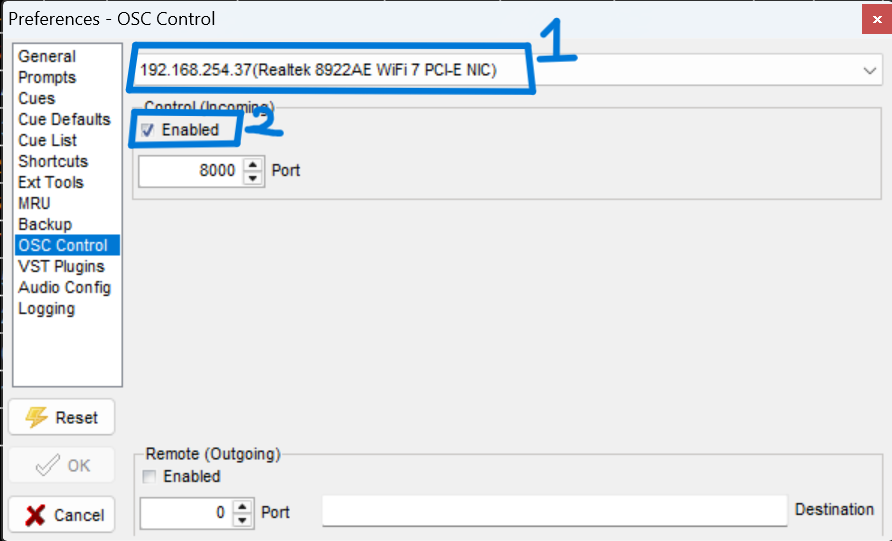
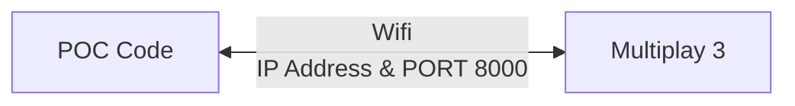
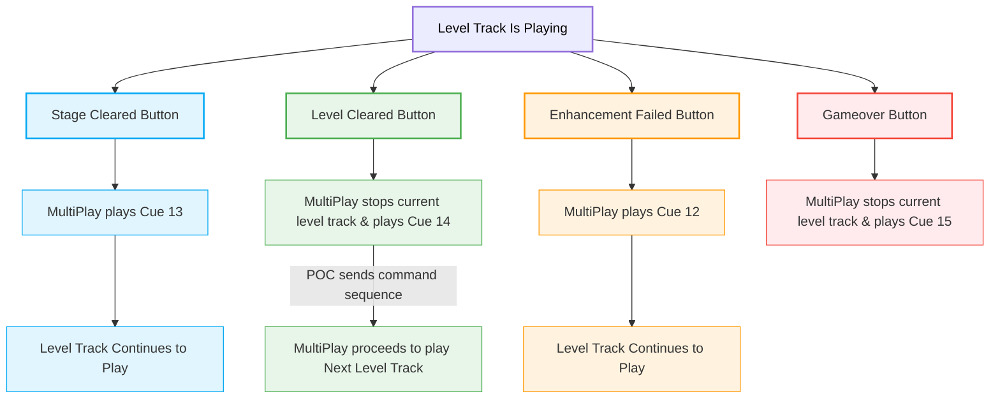

# OSC MultiPlay Guide

## Purpose

This software allows the game track to play one or more audio tracks at any given time, enhancing the players' experience with dynamic background music and real-time sound effects.

## Configuration and Setup

1. Download [MultiPlay3 Version 3.0.50.0](https://da-share.com/forum/index.php?topic=74.0).
2. Once downloaded, accept all preferences and permission prompts before launching the software.
3. In MultiPlay, navigate to **File** $\rightarrow$ **Preferences**.

4. Switch over to the **OSC Control** tab.

5. Under the OSC Control configurations:
* Select your **laptop's active IP Address** from the drop-down.
* Check the box to enable **Control (Incoming)**.
* Change the port number to `8000`.



> *Note: This port configuration allows MultiPlay to receive incoming UDP commands from the POC script.*


Once configured, click **OK**.

### Finding Your Laptop's IP Address

1. Open the **Command Prompt** (cmd) on your Windows machine.

2. Type `ipconfig` and press **Enter**. Your IPv4 address will be listed under your active network adapter.

---

## Architecture Flowchart



> ⚠️ **DISCLAIMER:** > Ensure that the IP address and Port configured inside your POC Python script perfectly match the settings applied in MultiPlay 3!

---

## Dummy Game Simulation

Before implementing the production code, `dummy_game.py` was built as a standalone simulation to ensure the Network/OSC communication pipeline functions properly.

```python
dummy_game.py
```

### Script Logic Breakdown

1. **GUI Engine:** Import `tkinter` to render the test control window.
```python
import tkinter as tk
```

2. **Network Protocol:** Import `socket` to dispatch OSC commands to MultiPlay over standard UDP packets.
```python
import socket
```

3. **Execution Interface:** Running the script initializes a control panel pop-up window:

4. **Level Navigation & Safety Locks:** Clicking any "Level" button immediately triggers the corresponding audio cue in MultiPlay while temporarily **freezing** all level selection buttons.
> *This allows testers to jump seamlessly between different levels for evaluation without having to play through chronologically.*


> 📌 *Note: The core design maps Level numbers directly to Cue tracks (e.g., Level 1 = Cue 1, Level 2 = Cue 2).*


#### Button Freezing Mechanism


```python
current_level = 1

def set_all_buttons_state(new_state):
    """
    Loops through the level selection buttons to toggle their clickability.
    """
    global all_level_buttons
    for button in all_level_buttons:
        button.config(state=new_state)

```


#### MultiPlay Cue Tracking Math


```python
def pressed(audio_track_level):
    global n
    global current_level  

    n = audio_track_level
    print(f"The audio track is {n}")

    # --- SMART MANUAL CUE BUTTONS (Handles index 0 to 6 automatically) ---
    if 0 <= n <= 6:
        # If an existing track is playing, stop it first
        if n > 0:
            send_message(IP, PORT, f"/cue/{n}/stop") 

        current_level = n + 1                              # Dynamic level calculation
        send_message(IP, PORT, f"/cue/{current_level}/go") # Dispatches play command

        set_all_buttons_state(tk.DISABLED)                 # Locks UI to prevent double inputs

```


5. **Real-time Event Triggers:** While a main level track loop runs, operators or systems can seamlessly fire secondary event responses:
* **a. Stage Cleared:** Can be pressed **multiple times** while the level track continues playing in the background.
```python
elif n == 13:                                # Stage Cleared event
     send_message(IP, PORT, "/cue/13/go") 

```


* **b. Level Cleared:** Instructs MultiPlay to play a victory sting, halt the current loop, step the tracking variable up, and fire the next level sequence.
```python
elif n == 14:                                # Level Cleared event
     send_message(IP, PORT, "/cue/14/go")    # Play victory sting
     send_message(IP, PORT, f"/cue/{current_level}/stop") # Stop background track

     current_level += 1                      # Increment level index
     send_message(IP, PORT, f"/cue/{current_level}/go")   # Initialize next track

```


*If the game is fully cleared (exceeding Level 7), the script auto-unfreezes the panel controls:*
```python
if current_level > 7:
     set_all_buttons_state(tk.NORMAL)

```


* **c. Enhancement Failed:** Can be triggered **multiple times** to flag player performance errors without stopping background loops.
```python
elif n == 12:                                # Incorrect hand gesture flag
     send_message(IP, PORT, "/cue/12/go")  

```


* **d. Game Over:** Abruptly stops active tracks and resets the user interface.
```python
elif n == 15:                                # Game Over state
     send_message(IP, PORT, "/cue/15/go")    # Play game over sound
     send_message(IP, PORT, f"/cue/{current_level}/stop") # Hard kill background track
     set_all_buttons_state(tk.NORMAL)        # Restore control interface

```


#### Comprehensive Event Flow Layout



---

## Production POC Code Integration

1. **Environment Configuration:** Network variables must match your target system's parameters:
```python
MULTIPLAY_LAPTOP_IP = "192.168.254.238" 
MULTIPLAY_PORT      = 8000  

```


2. **Network Handshake & Output Pipeline:** Wrapper functions handle connection dropouts and signal tracking cleanly.
```python
def create_osc_client(ip, port, system_name): 
    try: 
        client = udp_client.SimpleUDPClient(ip, port)
        print(f"[+] OSC ready -> {system_name} on {ip}:{port}")
        return client
    except Exception as e:
        print(f"[!] Network Pipeline Failed for {system_name}: {e}")
        return None

def send_osc_signal(client, address, message):
    if client is None: 
        return
    try: 
        client.send_message(address, message)
    except Exception: 
        pass 

```


3. **Initialization:** When a player presses `"S"`, the system bootstraps and kicks off Level 1 (`Cue 1`). *(Line 638)*
```python
send_osc_signal(multiplay_client, "/cue/1/go", 1)

```


4. **Life Loss Warning:** If a player loses a life, a failure warning layout is triggered dynamically via `Cue 12`. *(Lines 334, 343)*
```python
send_osc_signal(multiplay_client, "/cue/12/go", 1)

```


5. **Defeat Handling:** Losing all 3 structural player lives switches focus entirely to the global defeat array via `Cue 15`. *(Lines 329, 348)*
```python
send_osc_signal(multiplay_client, "/cue/15/go", 1)

```


6. **Sub-Stage Objectives:** Successful localized stage completions route instantly to `Cue 13`. *(Line 555)*
```python
send_osc_signal(multiplay_client, "/cue/13/go", 1)

```


7. **Major Milestone Success:** Compounding 3 clean stages passes the overarching level criteria, executing `Cue 14`. *(Lines 567, 577, 591)*
```python
send_osc_signal(multiplay_client, "/cue/14/go", 1)

```


8. **Dynamic Multi-Level Sequencing:** As game logic increments, variables adjust smoothly to handle indexing. *(Line 573)*
* Example: If `current_level = 1`, system targets `cue 1`. If stepped up to `2`, tracking references `cue 2`.


```python
current_level += 1
current_cycle = 0
game_status, status_display_time = "WIN", current_time
send_osc_signal(multiplay_client, f"/cue/{current_level}/go", 1)
send_osc_signal(multiplay_client, "/cue/14/go", 1)

```


9. **Hard System Interruption:** Pressing escape keys (`ESC` or `q`) kills active channels immediately upon termination. *(Line 625)*
```python
if key == ord('q') or key == 27: 
     send_osc_signal(multiplay_client, f"/cue/{current_level}/stop", 1)
     send_osc_signal(multiplay_client, "/cue/7/stop", 1)

```


> *Note: Cue 7 references a hidden bonus track asset. It is called out by name explicitly rather than utilizing standard incremental level variables.*