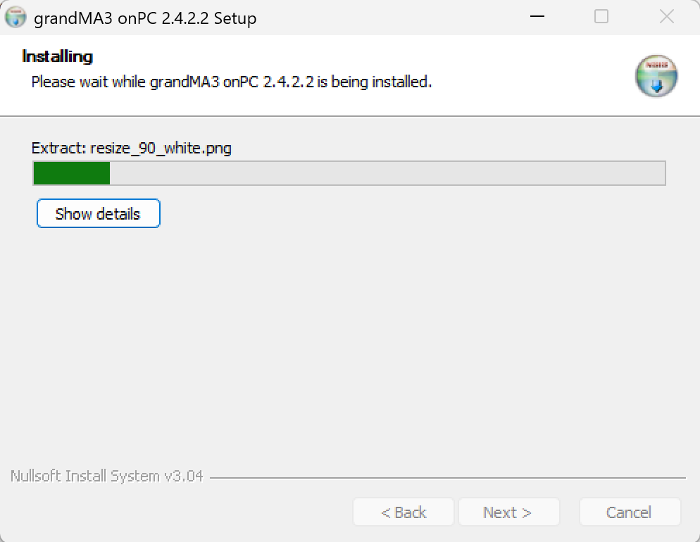
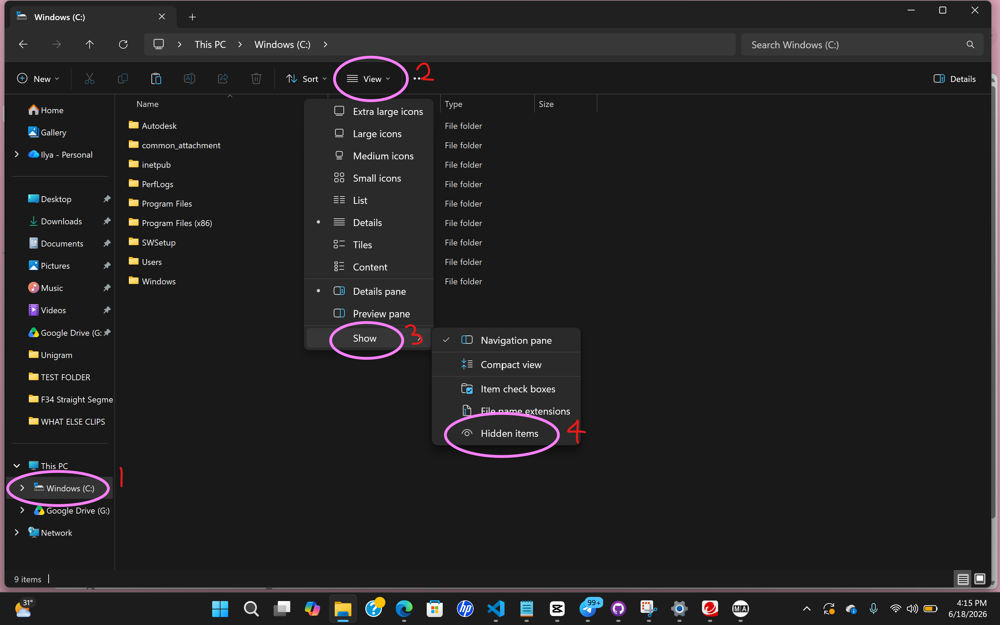
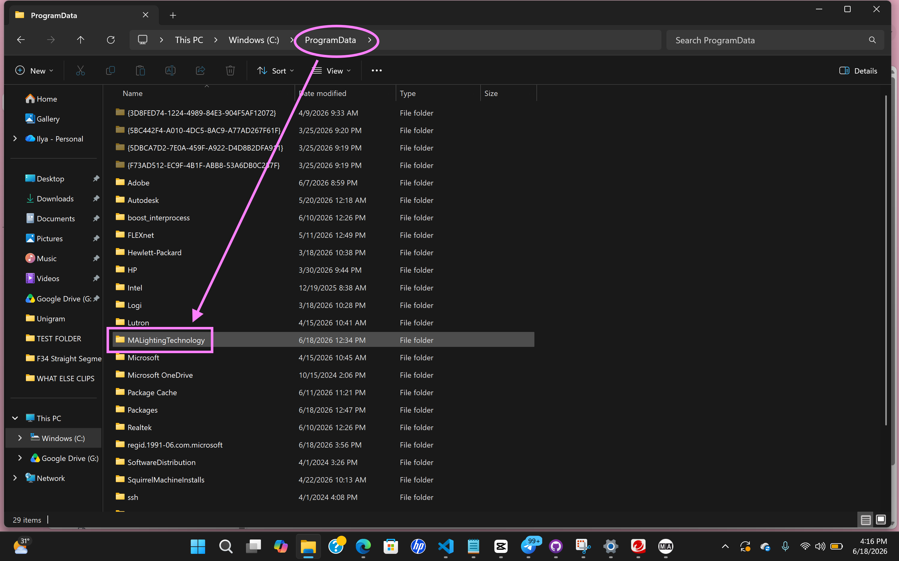
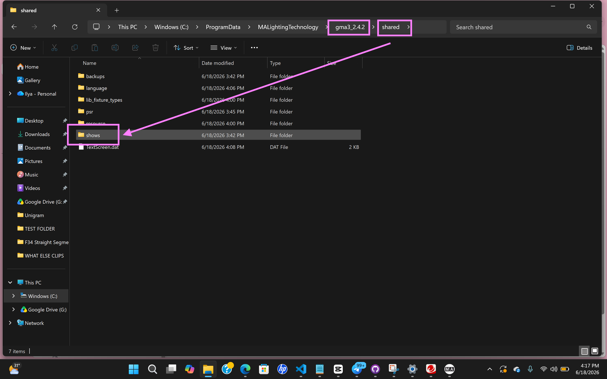
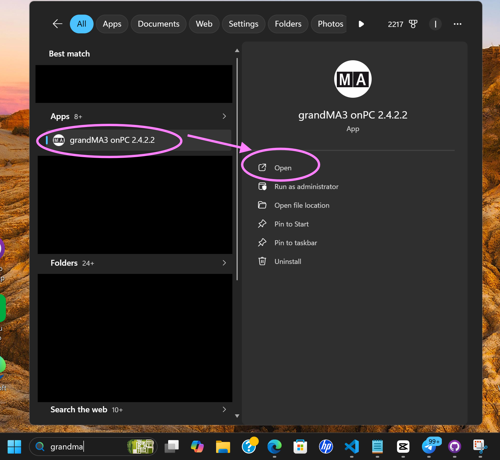
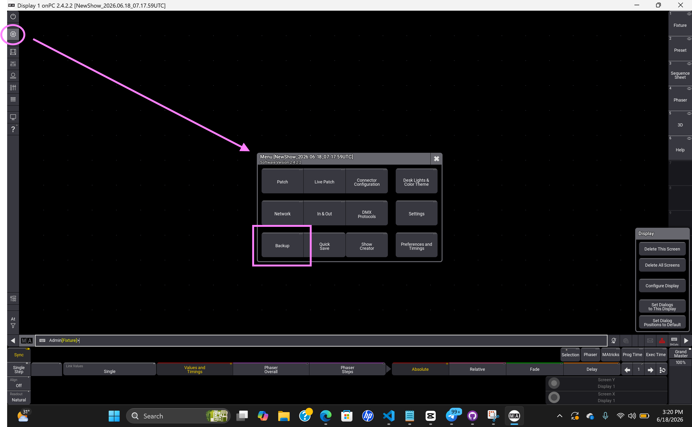
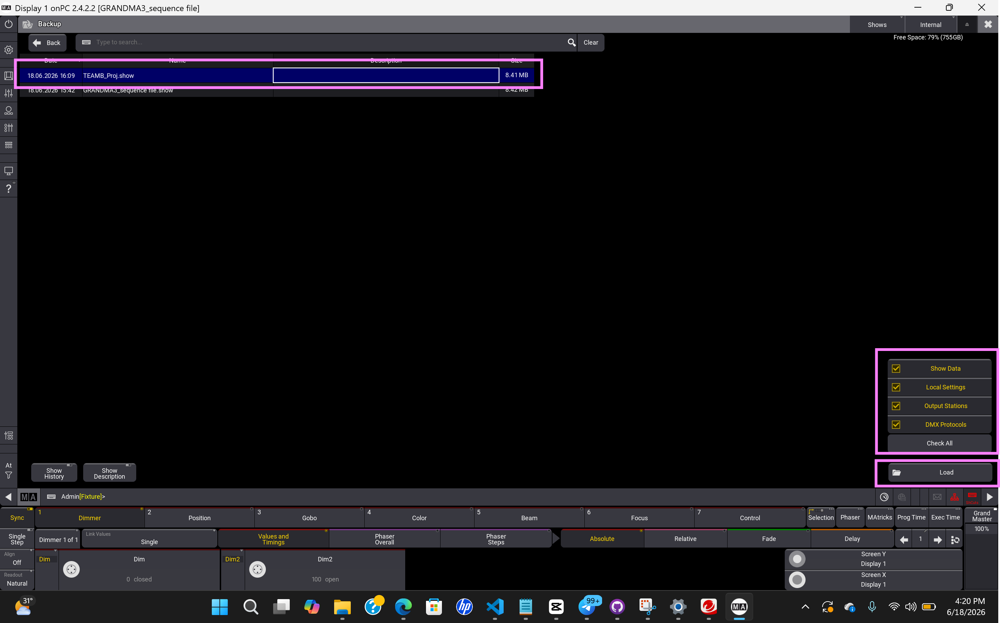
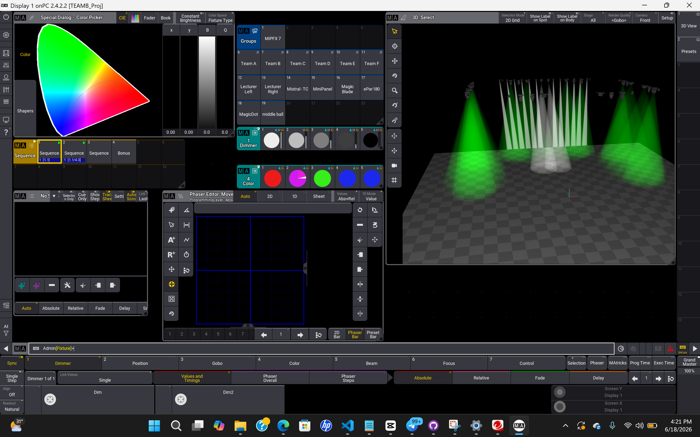
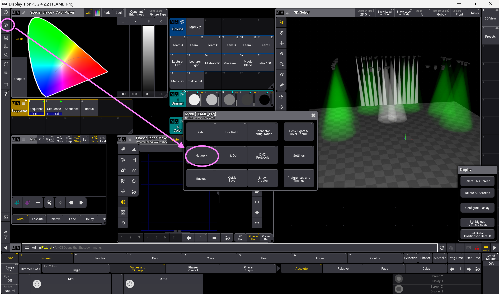
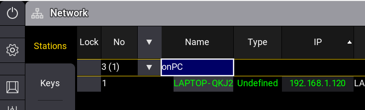

# OSC GrandMA3
## Purpose
This software allows user to do pre-programming and create lighting design for efficient and effective control of lighting setups. 
## Setup of software
1. Download software [grandMA3 onPC Software for Windows, 2.4.2.2](https://www.malighting.com/downloads/products/grandma3/)
2. Once downloaded, click Accept and download
3. Extract the software's zip file 
4. Click on "ma" in file
5. Click on "grandMA3_onPC_win_v2.4.2.2" in file 
6. Click "Yes"
7. A pop-up will appear, click "Next", "I agree", and lastly "Install"

   

   
 It takes some time to install... Roughly 5 minutes! :sleeping: 

     
   

8. Once installation completed, click "Next" 

9. Check box "Create GrandMA3 onPC Desktop Link" and click "Finish"

## Downloading of Show File

(This is the show file used for reference and example for the game)

[Showfile](TEAMB_Proj.show) 

1. Once downloaded, click on your CDRIVE, "View", "Show", and lastly, "Hidden Items" (This will unhide the folder that needs to be used, "Program Data")

2. Locate "Program Data" and click on it
3. Open "MALightingTechnology" 

4. Click on "gma3_2.4.2", "shared", and lastly, "Shows"

5. Lastly, copy & paste the downloaded file "TEAMB_Proj.show" into the "Shows" file

## How to use software
1. Locate GrandMA3 software on your laptop by searching...
   

     
   

2. Click "I agree"

3. Click on the :gear: "Gear" icon. Subpage will open, click on "Backup"

4. Click on the show file "TEAMB_Proj.show", click "Check all" and "Load"
 

5. In the end, you will see this interface.
 

6. Click on the :gear: "Gear" icon. Subpage will open, click on "Network"

7. Remeber Ip Address to put into the code

Congratulations! Once all steps are completed, your lighting is ready to be used with the game!