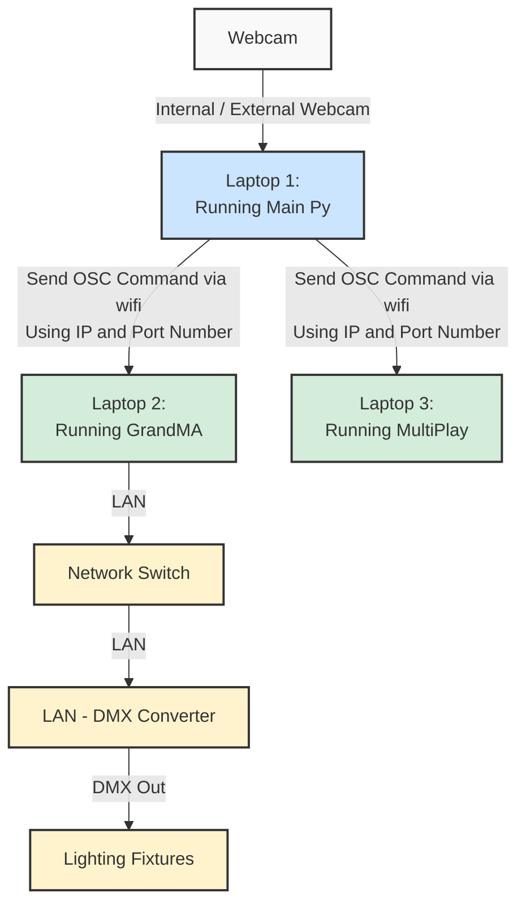

# Match The Gesture Game
##  EGL 314 - Proof Of Concept (POC)
---

This file contains our "Match The Gesture" game that uses **OpenCV + Mediapipe**. Additionally, this comprises also the use of **GrandMA3** Software for lighting controls and **MultiPlay** Software for audio controls <br>


## Table of Contents
---
1. **[Project Overview](#project-overview)**
   * Purpose of this project
   * How to set up
2. **[System Architecture](#system-architecture)**
   * Data Flowchart
3. **[Repository Structure](#repository-structure)**
    * Location Of Files
4. **[Gameplay Mechanics](#gameplay-mechanics)**
   * Game Rules & Objective
   * How To Play
---
# Project Overview
This project is a Proof Of Concept (POC) interactive, motion-controlled live production game where players step into the role of a mystical blacksmith enchanting a legendary weapon. Using a camera to detect physical hand gestures, players must match sequences across 6 progressively faster levels to unlock a high-intensity Bonus Round.

What sets this project apart is its integration with live theater tech: the game script acts as a show controller, broadcasting real-time **OSC network signals** to instantly drive professional stage lighting (**grandMA3**) and dynamic sound effects (**MultiPlay**) based on the player's performance

---
## How to Set up
Please refer to [Setup Guide](POC/Setup%20Guide.md) to see what do you need to have in order to run the game

>Note: This version is in the POC stage which means that the game is still in development. There will be more changes added to this game on a later date
---

## System Architecture

---
# Repository Structure
| Folder Location | File Name | Technical Roles & Functions |
| :--- | :---: | :---: |
| POC |  Hand_Images| Contains all the hand images that are used in the game |
|POC/Multiplay| Images&MultiPlay | Contains all the images on the GitHub and the MultiPlay file that was used for the POC Code|
|POC/Multiplay| dummy_game.py| Game Simulation to test OSC commands |
|POC/Multiplay| README.md| Contains all the set up and configuration in the Multiplay with POC and dummy_game codes explained |
|POC/grandMA3|Images| Contains images for more visual understanding |
|POC/grandMA3| grandMA3setup.md |Instructions on how to download and use GrandMA3|
|POC/grandMA3| TEAMB_Proj.show | Pre-made Show File for reference and use. Feel free to make changes in this file |
|POC| More data| More data |
> Note: All files Related to POC is inside the folder named: **POC**
---


# Gameplay Mechanics
### Game Rules & Objective

The **main objective** of the game is to successfully complete all 6 levels and survive the final Bonus Round to forge the legendary weapon before running out of lives
* **Beat the Clock:** Every stage is bound by a strict countdown timer. If the timer hits zero before you match the required gestures, you fail the enchantment

* **Progressive Difficulty:** As you advance through the 6 core levels, the enchantment timer gets shorter and faster, demanding quicker reflexes

* **The 3-Life Rule:** You begin your journey with 3 lives. If you fail a stage, you lose a life and are sent back to the start of the nearest milestone checkpoint (Level 1, 3, or 5). Losing all lives results in a Game Over

* **The Ultimate Test:** Completing Level 6 unlocks the high-intensity Bonus Round. You must survive 3 final rapid-fire gesture cycles to claim victory
---
# How To Play?
* **Position:** Stand clearly in front of your webcam, ensuring both your left and right hands are fully visible in the frame.

* **Start the Game:** Press the S key on your keyboard from the main title screen to begin the enchantment sequence.

* **Replicate the Runes:** Look at the active gesture boxes displayed on the screen. Physically mirror the exact left and right hand shapes using your own hands.

* **Charge the Bar:** Once you match the target gestures, hold the positions steady. A green "Charging" progress bar will appear—maintain the pose for 2 seconds to complete the stage.

* **Watch the Magic:** As you successfully progress or trigger game states, watch and listen as the script instantly changes your real-world room environment via theater tech integrations (grandMA3 lighting and MultiPlay audio)


## Game Setup & Start
* **Co-Op Calibration:** This game requires 2 players standing side-by-side in front of the webcam. Ensure both players' hands are completely visible within the frame
* **Ignite the Forge:** Press the S key on your keyboard from the main title screen to begin the game
## Gameplay Loop
* **Replicate the Gestures:** Once started, 4 target gestures will appear on the screen. Players must physically mirror these shapes with their hands

* **Divide and Conquer:**
    * Player 1 (Left Side): Must strictly match the 2 gestures displayed on the left side of the screen
    * Player 2 (Right Side): Must strictly match the 2 gestures displayed on the right side of the screen

* **Progressive Stages:** The game consists of 6 levels, and each level requires you to pass 4 progressive stages by holding the correct matching gestures
* GrandMA3: For each progressive stage passed, 1 lighting fixture will turn on to show the players' progress. This is triggered by ```GAME_SHOW_MAP``` . Green lights will also turn on to show level cleared, which happens with ```MA3_PASS_LEVEL_CMD``` .

* MultiPlay: Play level sound tracks. Every passed stages, there will be a ```stage_cleared``` audio track playing. If players completed the level, ```levelcleared``` audio track will be played.
* **Winning:** If the above is done correctly by matching the gestures on time, you win
## Penalties
* **Running Out of Time:** Each stage has a countdown timer. Failing to hold the required gestures before the timer hits zero results in a failed enchantment.

* **Losing Lives:** You begin with 3 lives. A time-out costs you a life, triggers a failure lighting state and sound effect, and triggers a rollback penalty.

* **Checkpoint Rollbacks:** If you lose a life, the game resets your stage progress and knocks you back to the beginning of your nearest major milestone checkpoint (Level 1, 3, or 5).

* **Game Over:** 
    
    **GrandMA3:** Incorrect gestures will trigger the red lights by ```MA3_GAMEOVER_CMD``` . If stage not cleared, will go back to the last level you were at. Eg. Incorrect gesture for level 4 stage 2, will go back to level 3. Shown in ```elif game_status == "LOSE":``` (Look for Line 390 in [POC Game Code](/POC/POC%20Game%20Code) for full code) 

    **MultiPlay:** For every incorrect gestures, an ```incorrect gestures``` audio track will be playing. If player lost 3 lives, ```gameover``` track will be played.
