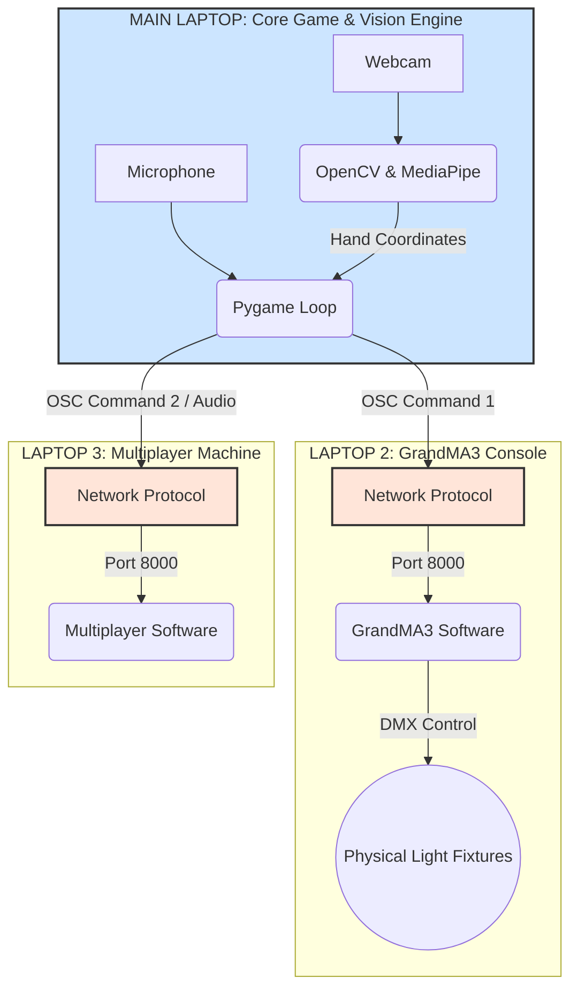

# Match The Gesture Game
##  EGL 314 - Proof Of Concept (POC)

This file contains our "Match The Gesture" game that uses **OpenCV + Mediapipe**. Additionally, this comprises also the use of **GrandMA3** Software for lighting controls and **Multiplayer** Software for audio controls  

## Table Of Contents
1) Project Overview
    * Purpose of this project
    * What are the software used
    * How to set it
2) System Architecture
    * Data Flowchart
3) Game Rules
    * Game Rules & Regulation
    * How to play

## Project Overview
This project is a Proof Of Concept (POC) interactive, motion-controlled live production game where players step into the role of a mystical blacksmith enchanting a legendary weapon. Using a camera to detect physical hand gestures, players must match sequences across 6 progressively faster levels to unlock a high-intensity Bonus Round.

What sets this project apart is its integration with live theater tech: the game script acts as a show controller, broadcasting real-time **OSC network signals** to instantly drive professional stage lighting (**grandMA3**) and dynamic sound effects (**Multiplayer**) based on the player's performance

|Note: This version is in the POC stage which means that the game is still in development. There will be more changes added to this game on a later date|
|-|

