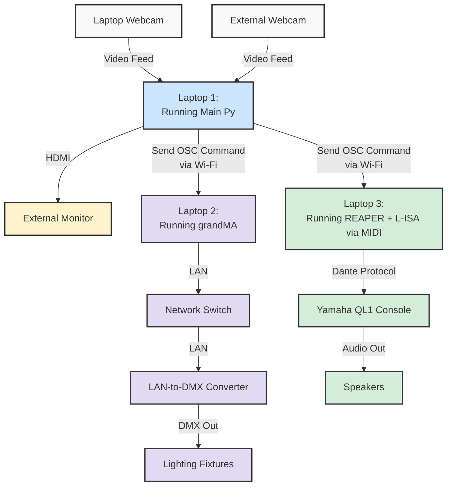

# EGL 314 - Media Solutioning Project 1 - Team B 
##  Project P.H.A.N.T.O.M
 **P**aranormal **H**azard **A**ssessment & **N**eutralization **T**raining **O**perations **M**odule = Project Phantom
## Table of Contents
1. **[Project Overview](#project-overview)**
   * Backstory of this project
   * Purpose of this project
   * Game Rules & Objective
   * Game Tutorial
   * How to set up
2. **[System Architecture](#system-architecture)**
   * Data Flowchart
3. **[Repository Structure](#repository-structure)**
    * Location Of Files
4. **[Versions](#versions)**
    * Types of game state-of-play
5. **[References and Sources](#references-and-sources)**
    * Location of where we got our informations from
6. **[Contributers](#done-by-yours-truly)**
    * Team members who have contributed in this repository
---
# Project Overview
## Purpose of this Project
Our purpose is to transform trainees into the industry's most elite Phantom Hunters. To achieve official certification, trainees must successfully complete four specialised training stations:

**Station 1| Site Inspection:** Assess environmental threats, identify entry points, and establish control zones

**Station 2 | Pack Recharge:** Manage power cells, maintain gear under pressure, and ensure continuous operation

**Station 3 | Phantom Sweep:** Systematically sweep complex areas to detect and track entity signatures

**Station 4 | Final Containment:** Apply ultimate capture protocols to safely trap and neutralize entities

Below is a detailed breakdown of how **Station 2 | Pack Recharge** plays out during the training

 ****
 ## Station 2 - Pack Recharge

[Pic of station]

In this station, players are suppose to recharge the guns which would be found in player's backpack. They have to place them on the table to maximise it's fullest potential

[Pic of guns on the table]

Players are suppose to mimic the hand gestures shown on the laptop. But there will be a twist. As the round goes on, they will slowly come to realise that they have to work together in order to clear the level. 

[Pic of Stage 1 - 3]

Especially in level 4, where the they would have to stand in front of the webcam attached to a tripod and do a shadow gesture together with the other player in order to finish the game

[Pic of stage 4 and location to stand]

Once the game is finished, the player's guns will be fully recharged and they will be automatically directed to the next station

[Pic of charged and uncharged guns]

---
# Game Rules & Objective

The **main objective** of the game is to successfully complete all 4 levels to upgrade the weapon before running out of lives and time
* **Beat the Clock:** Every stage is bound by a strict countdown timer. If the timer hits zero before you match the required gestures / shadows, you fail the stage and will have to restart

[Show timer]

* **Progressive Co-Op:** As you advance through the game, you realise that eventually both players must follow the same target gestures shown on the screen

[Show that the target from 4 becomes to 1 for all]

* **The 3-Life Rule:** You begin your journey with 3 lives. If you fail a stage, you lose a life and are sent back to the start of the stage. Losing all lives results in a Game Over

[Show the hearts]

* **The Ultimate Test:** Completing Level 3 unlocks the shadow charging round. Both player have to use 1 of their hands to form a shadow and must survive 3 of such rounds in order to finish the game

[Put the video]

---
# How To Play?
* **Position:** Stand at the spotlight in front of the laptop's webcam, ensuring both player's left and right hands are fully visible in the frame
[pic of spotlight infront of laptop]

* **Start the Game:** Both players are required to show their palms to begin the upgrading sequence

[Show homescreen]

* **Replicate the Runes:** Look at the active gesture boxes displayed on the screen. Physically mirror the exact left and right hand shapes using your own hands for levels 1-3

* **Charge the Bar:** Once you match the target gestures, hold the positions steady. A green "Charging" progress bar will appear—maintain the pose for 2 seconds to complete the stage

[Show that the progress bar is climbing up]

* **Watch the Magic:** As you successfully progress or trigger game states, watch and listen as the script instantly changes your real-world room environment via theater tech integrations (grandMA3 lighting and Reaper + L-ISA audio)
[Show lighting cues]

* **Team Bonding Challenge:** Upon passing level 3, player need to repoisiton themselves to where the spotlight is showing. [pic of spotlight infront of webcam] Each players need to use only 1 hand and they have to work together in order to replicate the gesture shown on the screen
[Pic of the video]

---
## How to Set up

Please refer to [Setup Guide](/Setup%20Guide.md) to see what do you need to have in order to run the game
***

## System Architecture

```mermaid
graph TD
    %% Style Definitions
    classDef inputs fill:#f9f9f9,stroke:#333,stroke-width:2px;
    classDef master fill:#cce5ff,stroke:#333,stroke-width:2px;
    classDef lighting fill:#e2d9f3,stroke:#333,stroke-width:2px;
    classDef audio fill:#d4edda,stroke:#333,stroke-width:2px;
    classDef hardware fill:#fff3cd,stroke:#333,stroke-width:2px;

    %% Visual & Input Hardware
    CAM1[Laptop Webcam] -->|Video Feed| B
    CAM2[External Webcam] -->|Video Feed| B
    B -->|HDMI| MON[External Monitor]

    %% Main Controller
    B[Laptop 1:<br>Running Main Py]

    %% Lighting Pipeline (Laptop 2)
    B -->|Send OSC Command<br>via Wi-Fi| C[Laptop 2:<br>Running grandMA]
    C -->|LAN| E[Network Switch]
    E -->|LAN| F[LAN-to-DMX Converter]
    F -->|DMX Out| G[Lighting Fixtures]

    %% Audio Pipeline (Laptop 3)
    B -->|Send OSC Command<br>via Wi-Fi| D[Laptop 3:<br>Running REAPER + L-ISA via MIDI ]
    D -->|Dante Protocol| QL1[Yamaha QL1 Console]
    QL1 -->|Audio Out| SPK[Speakers]

    %% Assign Styles
    class CAM1,CAM2 inputs;
    class B master;
    class MON hardware;
    class C,E,F,G lighting;
    class D,LISA,QL1,SPK audio;
```
---
# Repository Structure
| Folder Location | File Name | Technical Roles & Functions |
| :---: | :---: | :---: |
| [Main (Outside POC folder)](/README.md) |  README.md| Main readme file talking about the purpose of the project and the game itself |
| [Main (Outside POC folder)](/Setup%20Guide.md)|  Setup Guide.md| Contains the steps required in order the set up viewer's laptop to play the game |
| [Main (Outside POC folder)](/LICENSE) |  LICENSE| Contains the license for this repository |
| [POC](/POC/Hand_Images/) |  Hand_Images| Contains all the hand images that are used in the game |
| [POC](/POC/Capture%20Gesture.py) |  Capture Gesture.py| Contains python code for saving / deleting gesture|
| [POC](/POC/CAPTURE_GESTURE_README.md) | CAPTURE_GESTURE_README.md| Instructions on setup of capture gesture.py and how it works to add new gestures to new_gesture_definition.csv |
| [POC](/POC/new_gesture_definitions.csv) | new_gesture_definitions.csv | Stores all captured gestures in a format that is understood by the game |
| [POC](/POC/POC%20Game%20Code.py) | POC GAME CODE | Contains entire game code |
| [POC](/POC/grandma3/) |  grandma3| Folder containing all grandma3 setup and related pictures|
| [POC](/POC/Multiplay/) |  Multiplay| Folder containing all Multiplay setup and related pictures|
| [POC](/POC/POC%20README.md) |  POC README.py| File that contains all the instruction on how the POC game is suppose to be played|
|[POC/Multiplay](/POC/Multiplay/Images&MultiPlay/)| Images&MultiPlay | Contains all the images on the GitHub and the MultiPlay file that was used for the POC Code|
|[POC/Multiplay](/POC/Multiplay/dummy_game.py)| dummy_game.py| Game Simulation to test OSC commands |
|[POC/Multiplay](/POC/Multiplay/MultiPlay.md)| MultiPlay.md| Contains all the set up and configuration in the Multiplay with POC and dummy_game codes explained |
|[POC/grandMA3](/POC/grandma3/Images/)|Images| Contains images for more visual understanding |
|[POC/grandMA3](/POC/grandma3/grandMA3setup.md)| grandMA3setup.md |Instructions on how to download and use GrandMA3|
|[POC/grandMA3](/POC/grandma3/TEAMB_Proj.show)| TEAMB_Proj.show | Pre-made Show File for reference and use. Feel free to make changes in this file |
|[MVP](/MVP/MVP%20GameCode_NEW.py)| MVP Game Code.py | Contains the entire game code |
|[MVP](/MVP/new_gesture_definitions.csv)| new_gesture_definitions.csv | Stores all captured gestures in a format that is understood by the game |
|[MVP](/MVP/MVP%20Pictures/)| MVP Pictures| Stores all captured game's pictures and videos |
|[MVP](/MVP/image-classifier/)| image-classifier| Stores all captured game's pictures and videos |

---
# Versions
* [Proof Of Concept (POC)](/POC/POC%20Game%20Code.py) - This file contains the inital version of the game
* [Minimum Viable Product (MVP)](/MVP/MVP%20GameCode_NEW.py) - This file contains a enhanced version of the POC gameplay
***
# References and Sources:
* [Huats Club - OSC Starter Kit ](https://github.com/huats-club/oscstarterkit)
* [AI Machine Learning Link - Pls add this]()
***

### Done by yours truly:
<table>
  <tr>
    <td align="center">
      <a href="https://github.com/Devesty8">
         
        <b>Devesty8</b>
      </a> 
    </td>
    <td align="center">
      <a href="https://github.com/cel-esx">
         
        <b>cel-esx</b>
      </a> 
    </td>
    <td align="center">
      <a href="https://github.com/ilyaaqilah">
         
        <b>ilyaaqilah</b>
      </a> 
    </td>
    <td align="center">
      <a href="https://github.com/trippyfiq">
         
        <b>trippyfiq</b>
      </a> 
    </td>
  </tr>
</table>

