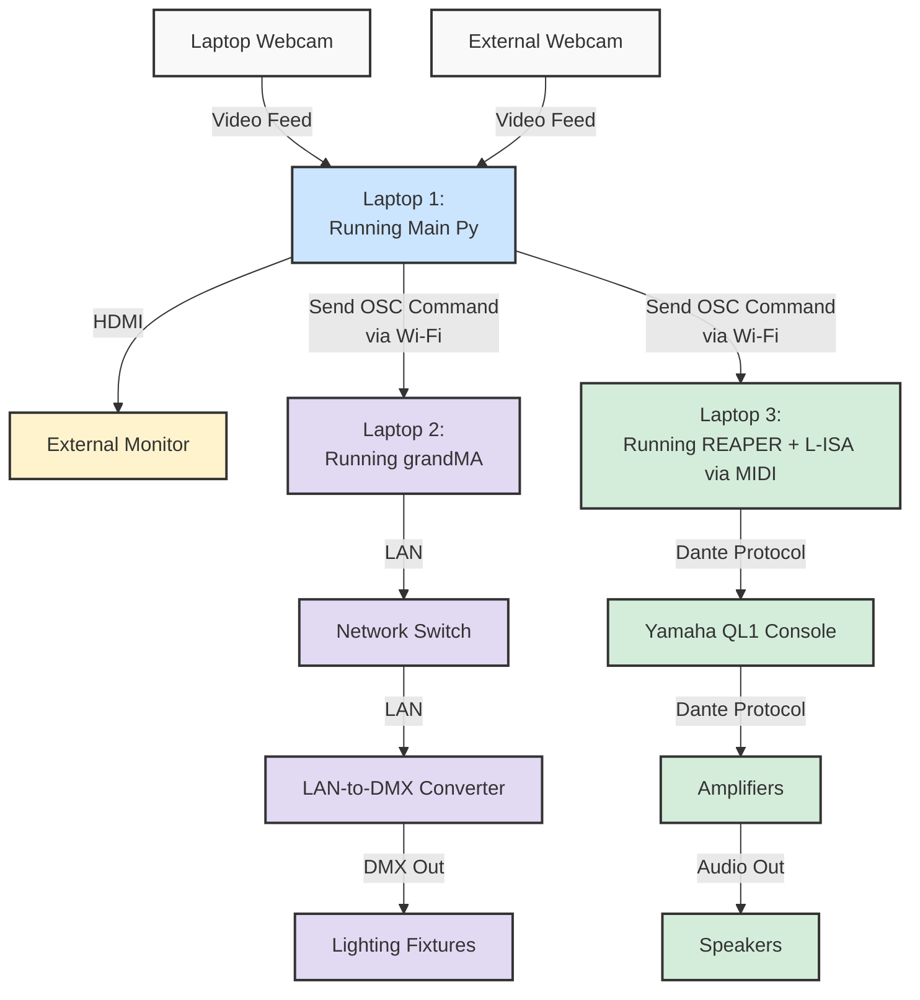

# EGL 314 - Media Solutioning Project 1 - Team B 
##  Project P.H.A.N.T.O.M
 Project P.H.A.N.T.O.M stands for **P**aranormal **H**azard **A**ssessment & **N**eutralization **T**raining **O**perations **M**odule
## Table of Contents
1. **[Project Overview](#project-overview)**
   * Purpose of this project
   * How to set up
2. **[System Architecture](#system-architecture)**
   * Data Flowchart
3. **[Repository Structure](#repository-structure)**
    * Location Of Files
4. **[Versions](#versions)**
    * Types of game state-of-play
5. **[References and Sources](#references-and-sources)**
    * Location of where we got our informations from
6. **[Contributers](#done-by-yours-truly)**
    * Team members who have contributed in this repository
---
# Project Overview
## Purpose of this Project
Our purpose is to transform trainees into the industry's most elite Phantom Hunters. To achieve official certification, trainees must successfully complete four specialised training stations:

**Station 1 | Site Inspection:** Assess environmental threats, while keeping clear of phantoms

**Station 2 | Pack Recharge:** Rechange phantom blasters using the training centre's official enhancement engine

**Station 3 | Phantom Sweep:** Begin tactical eradication drills to detect and destroy phantoms

**Station 4 | Final Containment:** Eradicate remaining phantoms without any sort of incident

Below is a detailed breakdown of how **Station 2 | Pack Recharge** plays out during the training

 ****
 ## Station 2 - Pack Recharge

This is the Pack Recharge Station where players will recharge their guns 

In this station, players are suppose to recharge the guns which would be found in player's backpack. They have to place them on the table to charge it up!

Players are suppose to mimic the hand gestures shown on the laptop. But there will be a twist. As the round goes on, they will slowly come to realise that they have to work together in order to clear the level. 

In level 4, Players would have to stand in the checkpoint that is behind a webcam attached to a tripod

Player's task do a shadow gesture together with the other player in order to finish the game

Once the game is finished, the player's guns will be fully recharged and they will be automatically directed to the next station

---
## How to Set up

Please refer to [Setup Guide](/Setup%20Guide.md) to see what do you need to have in order to run the game
***

## System Architecture

```mermaid
graph TD
    %% Style Definitions
    classDef inputs fill:#f9f9f9,stroke:#333,stroke-width:2px;
    classDef master fill:#cce5ff,stroke:#333,stroke-width:2px;
    classDef lighting fill:#e2d9f3,stroke:#333,stroke-width:2px;
    classDef audio fill:#d4edda,stroke:#333,stroke-width:2px;
    classDef hardware fill:#fff3cd,stroke:#333,stroke-width:2px;

    %% Visual & Input Hardware
    CAM1[Laptop Webcam] -->|Video Feed| B
    CAM2[External Webcam] -->|Video Feed| B
    B -->|HDMI| MON[External Monitor]

    %% Main Controller
    B[Laptop 1:<br>Running Main Py]

    %% Lighting Pipeline (Laptop 2)
    B -->|Send OSC Command<br>via Wi-Fi| C[Laptop 2:<br>Running grandMA]
    C -->|LAN| E[Network Switch]
    E -->|LAN| F[LAN-to-DMX Converter]
    F -->|DMX Out| G[Lighting Fixtures]

    %% Audio Pipeline (Laptop 3)
    B -->|Send OSC Command<br>via Wi-Fi| D[Laptop 3:<br>Running REAPER + L-ISA via MIDI]
    D -->|Dante Protocol| QL1[Yamaha QL1 Console]
    QL1 -->|Dante Protocol| AMP[Amplifiers]
    AMP -->|Audio Out| SPK[Speakers]

    %% Assign Styles
    class CAM1,CAM2 inputs;
    class B master;
    class MON hardware;
    class C,E,F,G lighting;
    class D,QL1,AMP,SPK audio;
```
---
# Repository Structure
| Folder Location | File Name | Technical Roles & Functions |
| :---: | :---: | :---: |
| [Main (Outside POC folder)](/README.md) |  README.md| Main readme file talking about the purpose of the project and the game itself |
| [Main (Outside POC folder)](/Setup%20Guide.md)|  Setup Guide.md| Contains the steps required in order the set up viewer's laptop to play the game |
| [Main (Outside POC folder)](/LICENSE) |  LICENSE| Contains the license for this repository |
| [POC](/POC/Hand_Images/) |  Hand_Images| Contains all the hand images that are used in the game |
| [POC](/POC/Capture%20Gesture.py) |  Capture Gesture.py| Contains python code for saving / deleting gesture|
| [POC](/POC/CAPTURE_GESTURE_README.md) | CAPTURE_GESTURE_README.md| Instructions on setup of capture gesture.py and how it works to add new gestures to new_gesture_definition.csv |
| [POC](/POC/new_gesture_definitions.csv) | new_gesture_definitions.csv | Stores all captured gestures in a format that is understood by the game |
| [POC](/POC/POC%20Game%20Code.py) | POC GAME CODE | Contains entire game code |
| [POC](/POC/grandma3/) |  grandma3| Folder containing all grandma3 setup and related pictures|
| [POC](/POC/Multiplay/) |  Multiplay| Folder containing all Multiplay setup and related pictures|
| [POC](/POC/POC%20README.md) |  POC README.py| File that contains all the instruction on how the POC game is suppose to be played|
|[POC/Multiplay](/POC/Multiplay/Images&MultiPlay/)| Images&MultiPlay | Contains all the images on the GitHub and the MultiPlay file that was used for the POC Code|
|[POC/Multiplay](/POC/Multiplay/dummy_game.py)| dummy_game.py| Game Simulation to test OSC commands |
|[POC/Multiplay](/POC/Multiplay/MultiPlay.md)| MultiPlay.md| Contains all the set up and configuration in the Multiplay with POC and dummy_game codes explained |
|[POC/grandMA3](/POC/grandma3/Images/)|Images| Contains images for more visual understanding |
|[POC/grandMA3](/POC/grandma3/grandMA3setup.md)| grandMA3setup.md |Instructions on how to download and use GrandMA3|
|[POC/grandMA3](/POC/grandma3/TEAMB_Proj.show)| TEAMB_Proj.show | Pre-made Show File for reference and use. Feel free to make changes in this file |
|[MVP](/MVP/MVP%20GameCode.py)| MVP Game Code.py | Contains the entire game code |
|[MVP](/MVP/MVP_gesture_definitions.csv)| MVP_gesture_definitions.csv | Stores all captured gestures in a format that is understood by the game |
|[MVP](/MVP/MVP%20Pictures/)| MVP Pictures| Stores all captured game's pictures and videos |
|[MVP](/MVP/Station%20Pictures/)| Station Pictures| Pictures Of our Game Station |
|[MVP](/MVP/MVP%20README.md)| MVP README.md| File that contains all the instruction on how the MVP game is suppose to be played |
|[MVP](/MVP/image-classifier/)| image-classifier| AI Model training files for shadow detection game |
[MVP/image-classifier](/MVP/image-classifier/MVP/image-classifier/Image-ClassifierSetUp.md)| Image-ClassifierSetUp.md|This is the setup guide for the Jupyter Notebook in order to get the AI to detect the shadows during the shadow level|
|[MVP/image-classifier](/MVP/image-classifier/Essential%20Folder/)| Essential Folder | This folder compiles files used to classify images and train the AI to understand and recognise the images.|
|[MVP/image-classifier](/MVP/image-classifier/JupyterSetUpImages)| JupyterSetUpImages | Images used in the Image-ClassifierSetUp.md |
[MVP/L-ISA](MVP/L-ISA)| README.md | This is the L-ISA set up and configuration tutorial file.|
[MVP/L-ISA](MVP/L-ISA)| Images | Images used in the README.md file.|
[MVP/L-ISA](MVP/L-ISA)| Project_Phantom_Lisa.lisa | L-ISA file used for MVP project.|
[MVP/reaper](MVP/reaper)| README.md | This is the Reaper set up and configuration tutorial file.|
[MVP/reaper](MVP/reaper)| Images | Images used in the README.md file.|
[MVP/reaper](MVP/reaper)| GAME_SIMULATION.py | Tinkter file for game simulation.|
[MVP/reaper](MVP/reaper)| Project_Phantom_Reaper.rpp | Reaper file used for MVP project.|
[MVP/GrandMa3](MVP/GrandMA3)| README.md | This is the GrandMa3 show documentation.|
[MVP/GrandMa3](MVP/GrandMA3)| Project Phantom show | This is the GrandMa3 show.|
[Final Assessment](/Final%20Assessment/best_model.pth)| best_model.pth|Trained Machine Learning Model| During the shadow gesture part, the machine will use the information from here to detect
[Final Assessment](/Final%20Assessment/Capture%20Gesture.py)| Capture Gesture.py| Contains python code for saving / deleting gesture
[Final Assessment](/Final%20Assessment/Final%20Assessment%20Game%20Code.py)| Final Assessment Game Code.py| Contains the entire game code
[Final Assessment](/Final%20Assessment/Final_gesture_definitions.csv)|Final_gesture_definitions.csv| Stores all captured gestures in a format that is understood by the game
[Final Assessment](/Final%20Assessment/Heart.png)| Heart.png| Contains a image of a heart used in the game
[Final Assessment/MVP Pictures](/Final%20Assessment/MVP%20Pictures/)| Images| These are the pictures that are used for the game's UI|

> Note: To navigate to desired location, click on the links at **Folder Location** in the above table  

---
# Versions
* [Proof Of Concept (POC)](/POC/) - This folder contains the inital version of the game
* [Minimum Viable Product (MVP)](/MVP/) - This folder contains a enhanced version of the POC gameplay
* [Final Version](/Final%20Assessment/) - This folder contains the final version of the game
***
# References and Sources:
* [Huats Club - OSC Starter Kit ](https://github.com/huats-club/oscstarterkit)
* [AI Machine Learning](https://www.youtube.com/playlist?list=PL3Dh_99BJkCEhE7Ri8W6aijiEqm3ZoGRq)
***

### Done By Yours Truly:
<table>
  <tr>
    <td align="center">
      <a href="https://github.com/Devesty8">
         
        <b>Devesty8</b>
      </a> 
    </td>
    <td align="center">
      <a href="https://github.com/cel-esx">
         
        <b>cel-esx</b>
      </a> 
    </td>
    <td align="center">
      <a href="https://github.com/ilyaaqilah">
         
        <b>ilyaaqilah</b>
      </a> 
    </td>
    <td align="center">
      <a href="https://github.com/trippyfiq">
         
        <b>trippyfiq</b>
      </a> 
    </td>
  </tr>
</table>

