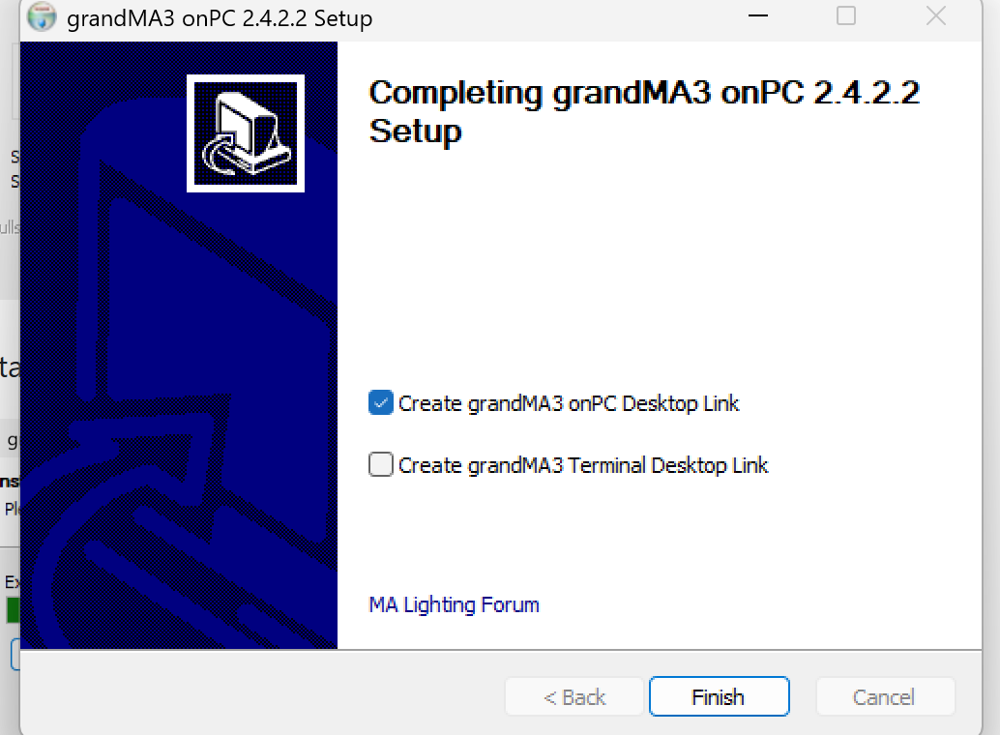
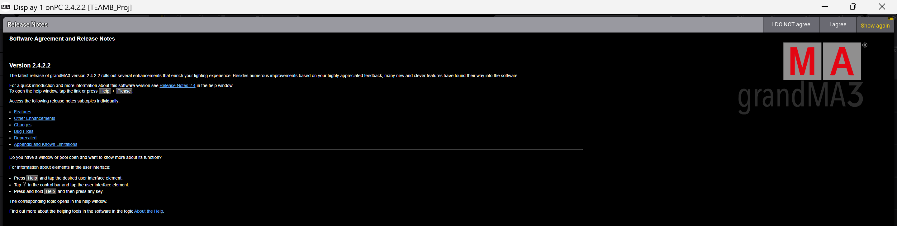

# OSC GrandMA3
## Purpose
This software allows user to do pre-programming and create lighting design for efficient and effective control of lighting setups. 
## Setup of software
1. Download software [grandMA3 onPC Software for Windows, 2.4.2.2](https://www.malighting.com/downloads/products/grandma3/)
2. Once downloaded, click Accept and download
3. Extract the software's zip file 
4. Click on "ma" in file
5. Click on "grandMA3_onPC_win_v2.4.2.2" in file 
6. Click "Yes"
7. Click "Next" to continue.

8. Click "I Agree"

9. Click "Install"

It takes some time to install... Roughly 5 minutes! :sleeping:

10. Once installation completed, click "Next" 

11. Check box "Create GrandMA3 onPC Desktop Link" and click "Finish"

## How to use software
1. Locate GrandMA3 software on your laptop by searching "grandMA3 onPC 2.4.2.2" on Search Bar. It will lead you to this page: 

You can either click on "Preview" that would appear on the right of the software OR click the name of software to open the software.

2. Click "I agree"

[Showfile](TEAMB_Proj.show)