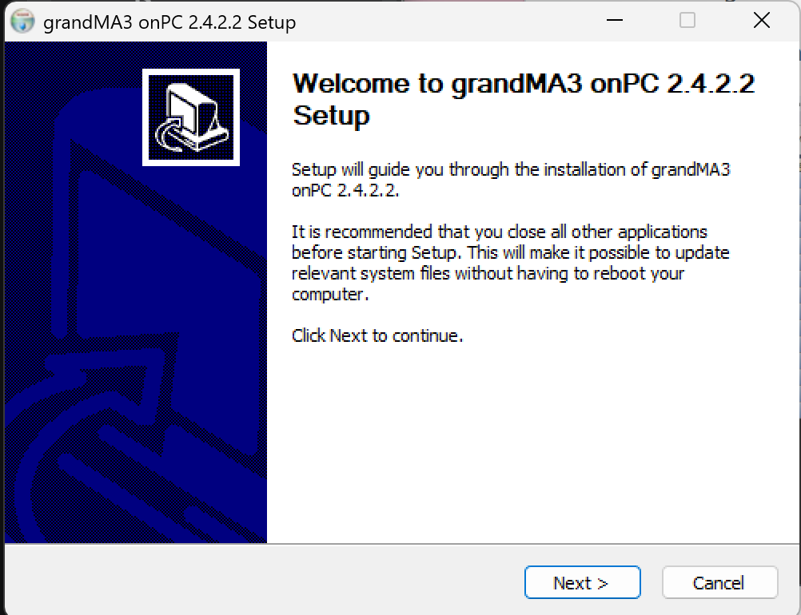
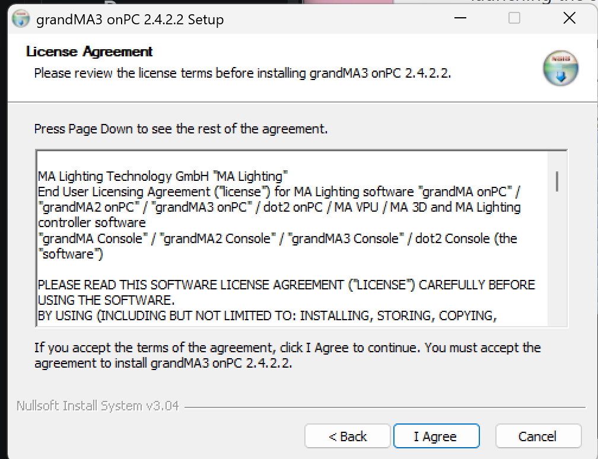
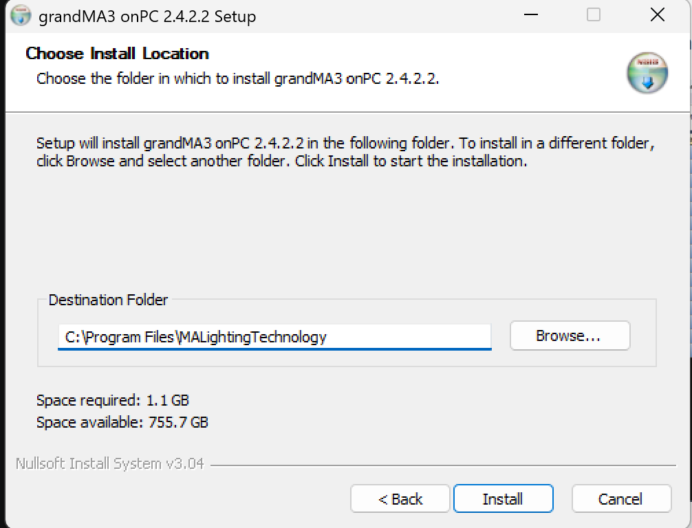

# OSC GrandMA3
## Purpose
This software allows user to do pre-programming and create lighting design for efficient and effective control of lighting setups. 
## Setup of software
1. Download software [grandMA3 onPC Software for Windows, 2.4.2.2](https://www.malighting.com/downloads/products/grandma3/)
2. Once downloaded, click Accept and download
3. Extract the software's zip file 
4. Click on 'ma' in file
5. Click on 'grandMA3_onPC_win_v2.4.2.2' in file 
6. Click 'Yes'

7. 
8. 

